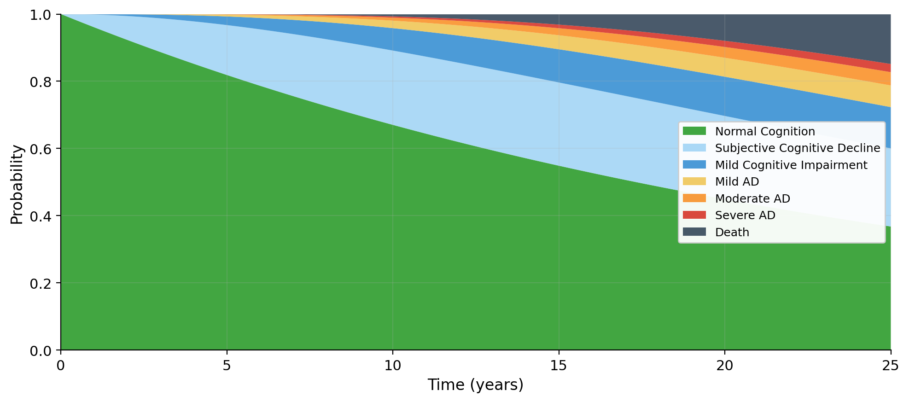

<!-- _class: lead -->
<!-- _paginate: false -->
<!-- _header: '' -->
<!-- _footer: '' -->

# Tim Reska

AI-Augmented Medical Underwriting

*What I built in 48 hours with Claude to show you what's possible*

PhD Helmholtz Munich  &middot;  github.com/ttmgr  &middot;  March 2026

---

# My PhD trained me to model biological state transitions — the same math behind disease progression

*Tim Reska  |  PhD Helmholtz Munich & TU Munich  |  github.com/ttmgr*

- **4 years modeling biological processes over time**: pathogen evolution through resistance states = CTMC — the same framework powering MedRisk-ADH's disease models
- **8 publications** incl. *Nature Communications* — 22,000+ accesses, 43+ citations
- **10 pipelines across 7 sites in DE/FR/ES**: built quality-aware systems that adapt to 95% (DE) vs 60% (ES) data completeness — the same challenge in underwriting
- **36-month LLM evaluation** (22 models): I know where AI works and where it produces "plausible but wrong" outputs
- I applied all of this to medical underwriting — and built the proof in **48 hours with Claude**

*Source: ISME Communications 2024, Helmholtz Munich publication record*

---

# Underwriting models are confidently wrong when data quality is poor

*I found this failure mode in genomics AI — it applies directly to insurance*

- Model scores patient as "78% high risk" based on 3 diagnoses, no labs — score **looks right**, passes every sanity check
- But it's echoing training data averages, not this patient's reality — I call this **"Plausible but Wrong"** (ISME Communications 2024)
- 100,000 decisions/year &times; 2% PBW = **2,000 mispriced policies** per year
- **Invisible** in standard metrics (AUC, Brier score look fine in aggregate)
- EU AI Act 2024: Art. 14+15 require **per-case reliability assessment** — no production system today validates this

*Source: ISME Communications 2024; EU AI Act Regulation 2024/1689*

---

# I built a working underwriting system in 48 hours to show you what's possible

*Not a slide deck — a running application with 231 tests and every number verified against PubMed*

`Patient Record → Data Quality Score → Right Model → P(wrong) → Accept / Review / Reject`

- Scores data quality **before** the model runs — flags insufficient inputs
- Routes to the right model for available data (**no imputation**, no manufactured confidence)
- Estimates **P(wrong)** per case and makes cost-optimal accept/review/reject decisions
- Full **audit trail** for every decision — EU AI Act Art. 14+15 compliant
- Built with **Claude as co-pilot**: architecture, 21,000 lines of code, 231 tests in 48 hours

---

# International markets show 2.4x higher mispricing risk than Germany

*4 European markets, controlled data quality degradation — the same 3 countries I worked in for genomics*

| Market | Data Quality | Mean DQS | PBW Flag Rate |
|--------|-------------|----------|---------------|
| Germany (DE) | High (95% coding, 92% labs) | 0.85 | 0.9% |
| France (FR) | Good (90% coding, 88% labs) | 0.80 | 1.0% |
| Spain (ES) | Medium (80% coding, 75% labs) | 0.70 | 1.3% |
| International | Low (60% coding, 50% labs) | 0.45 | **2.1%** |

> The worst market has **2.4x the mispricing risk** — and standard metrics don't see it.

*Source: MedRisk-ADH synthetic cohort, N=4,000 (1,000 per market), seed=42*

---

# I added Alzheimer's disease in one config file — the same CTMC math from my PhD

*7 states from normal cognition to death — the same state-transition modeling I used for pathogen evolution*

**Same math, new domain:** pathogen resistance states → cognitive decline stages. 8 ICD-10 codes, 4 biomarkers, 4 medications, ApoE4 modifier. *Zero changes to the core engine.*

*Source: Transition rates from Petersen et al. NEJM 2018, Brookmeyer et al., NACC-UDS*

---

# AI-driven underwriting solves five problems current methods cannot

| What you need | Rules / Actuarial | Basic ML | What I build |
|---------------|-------------------|----------|-------------|
| Know when to trust the AI | No | No | *DQS + P(wrong) per case* |
| Handle incomplete records | Reject | Impute (creates PBW) | *Route to right model* |
| Explain each decision | No | Limited | *SHAP per patient + audit* |
| Model disease progression | Static tables | No | *CTMC for any disease* |
| EU AI Act compliance | Partial | Difficult | *Built in from day 1* |

*Phase 3: LLM agents extract structured data from doctor notes across DE/FR/ES/EN and verify parameters against PubMed.*

---

# The expert understands disease progressions — the LLM handles the rest

*Domain expertise drives the architecture — AI handles the scale*

### My process
1. **I bring the domain knowledge** — disease progression modeling from 4 years of PhD research, data quality management from 7 international sites
2. **Claude builds at scale** — 21,000 lines, 231 tests, 4 markets, 2 disease models in 48 hours
3. **I verify the science** — LLM agents query PubMed, I validate against my training in biological state transitions
4. **Claude handles the engineering** — testing, documentation, EU AI Act compliance, deployment
5. **I make the decisions** — which transition rates are plausible, which biomarkers matter, when to trust the model

> The bottleneck is no longer engineering capacity. It's **domain expertise and data access**.

---

# In 90 days I'd deliver calibrated PBW detection on real claims data

### Month 1 — Audit & Map
Audit current underwriting pipeline for PBW risk. Map data quality across target markets. Identify the **3 highest-impact failure modes**.

### Month 2 — Calibrate & Train
Calibrate DQS on real claims data. Retrain model router on actual data profiles. Deliver **first real-data PBW prevalence estimate** by market.

### Month 3 — Ship & Document
Production prototype: **REST API** for per-case quality scoring. Validated PBW detection rates. **EU AI Act compliance documentation**.

> I built this proof of concept in 48 hours. Imagine what I do with real data and 90 days.

---

<!-- _class: lead -->
<!-- _paginate: false -->

# Let's build this together.

**Tim Reska**
PhD Helmholtz Munich  &middot;  8 publications  &middot;  3 years evaluating Claude

timreska@gmail.com  &middot;  github.com/ttmgr  &middot;  linkedin.com/in/timreska

*All data in this demo is synthetic. The system, the science, and the skills are real.*
