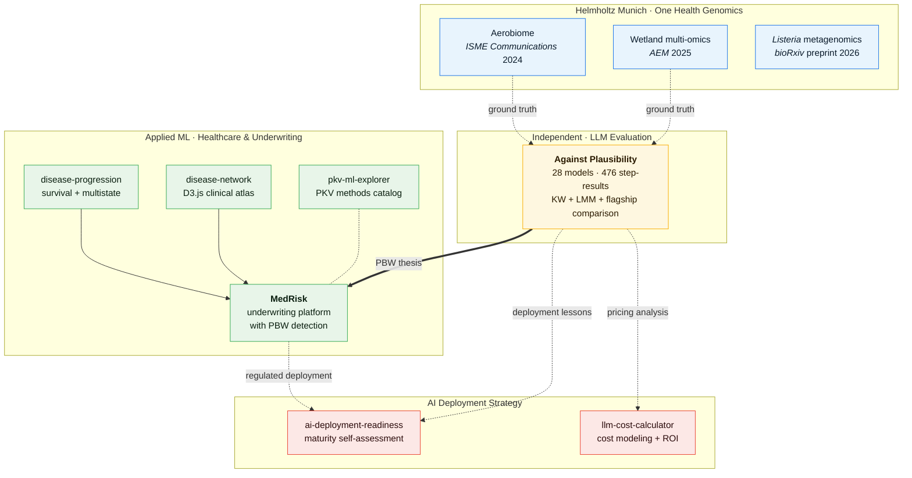
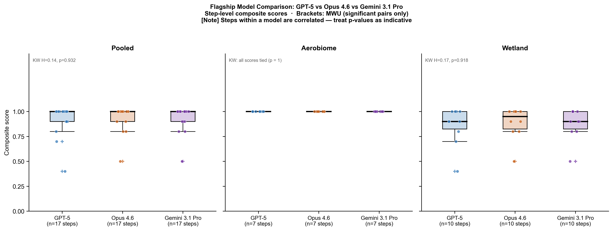

# Tim Reska

**Research Scientist · LLM Evaluation · AI Deployment Strategy · Production ML for Regulated Industries**

PhD candidate at Helmholtz Munich and the Technical University of Munich (defense July 2026). 3 years evaluating LLMs across 28 models and three major families. Builder of production AI systems for medical underwriting with EU AI Act governance. 8 peer-reviewed publications including *Nature Communications*.

I know where AI works, where it fails, and how to help organisations deploy it.

Within the broader [GenomicsForOneHealth](https://github.com/ttmgr/GenomicsForOneHealth) collection (One Health group at the University of Zurich, supervised by [Lara Urban](https://sites.google.com/view/urban-lab/home)), my main contributions are in environmental metagenomics and food safety.

Links: [Email](mailto:timreska@gmail.com) · [LinkedIn](https://linkedin.com/in/tim-r-ai) · [ORCID](https://orcid.org/0009-0001-9700-5128)

## Portfolio at a glance



The peer-reviewed bioinformatics pipelines on the left double as ground truth for the LLM evaluation in the centre. The "plausible but wrong" failure mode that emerged from that evaluation is operationalized in the applied-ML portfolio on the right, and the deployment lessons feed into the AI strategy tools at the bottom.

---

## Research · One Health Genomics

My scientific work develops nanopore sequencing workflows for pathogen surveillance across air, water, food, and clinical settings. These pipelines serve as the validated ground truth for the LLM evaluation below.

| Project | Status | Repository |
|---|---|---|
| Air monitoring by nanopore sequencing | Published · *ISME Communications* 2024 | [GenomicsForOneHealth/Air_Metagenomics](https://github.com/ttmgr/GenomicsForOneHealth/tree/main/Environmental_Metagenomics/Air_Metagenomics) · [Pipeline overview](./pipelines/aerobiome/) |
| Wetland multi-omics surveillance | Published · *AEM* 2025 (shared first author) | [GenomicsForOneHealth/Wetland_Health](https://github.com/ttmgr/GenomicsForOneHealth/tree/main/Environmental_Metagenomics/Wetland_Health) · [Pipeline overview](./pipelines/wetland-surveillance/) |
| *Listeria* metagenomic surveillance | Preprint · *bioRxiv* 2026 | [GenomicsForOneHealth/Listeria-Adaptive-Sampling](https://github.com/ttmgr/GenomicsForOneHealth/tree/main/Food_Safety/Listeria-Adaptive-Sampling) · [Pipeline overview](./pipelines/listeria-adaptive-sampling/) |

### Publications (first, second, or third author)

1. **Reska T**, Pozdniakova S, Urban L. [Air monitoring by nanopore sequencing](https://doi.org/10.1093/ismeco/ycae058). *ISME Communications* (2024).
2. Perlas A\*, **Reska T**\*, Sanchez-Cano A, et al. [Real-time genomic pathogen, resistance, and host range characterization from passive water sampling of wetland ecosystems](https://doi.org/10.1101/2025.09.05.674394). *Applied and Environmental Microbiology* (2025). Shared first authorship.
3. Sauerborn E, Corredor NC, **Reska T**, et al. [Detection of hidden antibiotic resistance through real-time genomics](https://www.nature.com/articles/s41467-024-49851-4). *Nature Communications* (2024).
4. Muchaamba F, **Reska T**, Biggel M, Locken KM, Weilguny L, Corti S, Kelbert L, Stephan R, Urban L. [A metagenomic framework for rapid *Listeria monocytogenes* surveillance in food production environments](https://www.biorxiv.org/content/10.64898/2026.04.23.720354v1). *bioRxiv* preprint (2026).
5. Varzanadi AR, **Reska T**, et al. Environmental screening detects *Batrachochytrium dendrobatidis*. *Global Ecology and Conservation* (2025).

---

## LLM Evaluation · Against Plausibility

A structured benchmark of **28 models across 476 scored step-results** testing whether LLMs can build real scientific workflows — not just produce locally plausible code. Two validated nanopore pipelines serve as ground truth: a 7-step aerobiome workflow and a 10-step multi-omics wetland workflow.

The dominant failure mode: **"plausible but wrong"** — generated code that runs, looks reasonable, and would pass a surface-level review, but makes domain-specific choices that an expert would immediately reject. These failures are invisible to automated benchmarks and dangerous in regulated environments.

**No model in any family produces a fully correct 10-step wetland pipeline.** Three of those steps have zero fully-correct answers across all 28 evaluated entries.


*Wetland pipeline (10 steps x 28 evaluated entries). The light columns on the right are where every model in every family fails.*


*Flagship comparison: GPT-5 vs Opus 4.6 vs Gemini 3 Pro. Differences are not statistically significant on aerobiome — the bottleneck is benchmark statistical power, not family advantage.*

### Lessons for enterprise AI deployment

Models that achieve 95%+ on isolated coding tasks can still fail 40–60% of the time on sequential pipeline tasks. Surface-level benchmarks are insufficient for deployment decisions in regulated environments. Any organisation deploying AI for multi-step analytical workflows needs domain-expert evaluation, not just code-correctness metrics.

The scoring framework (tool selection, parameter accuracy, output compatibility, scientific validity, executability) generalises to any domain where AI-generated workflows must be validated against expert ground truth — legal document drafting, financial model construction, clinical decision support, or any multi-step analytical pipeline.

Links: [Full evaluation](./llm-eval/) · [Evaluation framework](./llm-eval/methodology/evaluation_framework.md) · [Curated findings](./llm-eval/evaluations/summary.md) · [Scoring criteria](./llm-eval/methodology/scoring_criteria.md)

---

## Production AI · Healthcare & Underwriting

### MedRisk — AI underwriting with failure mode detection

Automated underwriting AI fails most dangerously not when it is obviously wrong — but when it is **confidently wrong on low-quality data**. MedRisk computes a Data Quality Score for each patient before inference, then flags cases where model confidence exceeds what the input data can support.

Three risk models (XGBoost + Platt calibration, Cox PH survival, continuous-time Markov chain disease progression), a validation layer (DQS, calibration-confidence mismatch, epistemic uncertainty, PBW detection, conformal prediction), an underwriting decision engine with clinical-rule checks, and a governance layer with audit logging and human-override workflow.

GDPR-safe multi-market synthetic cohort generator (DE/FR/ES/INT profiles). 9 external cohort adapters (NHANES, UK Biobank, BioLinCC, CDC PLACES, Zenodo). SHAP explainability. EU AI Act article mapping. **442 tests.**

Stack: Python 3.11+, XGBoost, lifelines, SHAP, Streamlit, reportlab.

Links: [`medrisk/`](./medrisk/)

### Disease progression modeling

Survival analysis and transformer-based architectures on synthetic FHIR/OMOP longitudinal records. Two clinical tracks (cardiovascular disease, Type 2 diabetes). Cox PH, multistate Markov, DeepSurv, DeepHit, SurvTRACE. Fairness auditing, model cards, GDPR/EU AI Act regulatory context.

Links: [`disease-progression/`](./disease-progression/)

### Interactive clinical atlas

D3.js browser dashboard for visualising disease state transitions and comparing intervention scenarios in a medical underwriting context. Eight disease nodes, evidence-linked uncertainty bands, patient profile controls. No framework dependencies.

Links: [`disease-network/`](./disease-network/)

### PKV ML framework explorer

Self-contained browser catalog of ML and actuarial methods for German private health insurance. Covers logistic regression, random forest, LSTM, autoencoder, survival analysis, and agentic AI orchestration.

Links: [`pkv-ml-explorer/`](./pkv-ml-explorer/)

---

## AI Deployment Strategy · Tools

### AI Deployment Readiness Assessment

Open-source CLI tool for organisations evaluating AI deployment. 25 questions across five dimensions (data infrastructure, process maturity, governance, talent, executive sponsorship), weighted scoring, maturity tier assignment (Exploring / Piloting / Scaling / Optimizing), sector benchmarks, and prioritised recommendations.

Built on published AI maturity frameworks (Gartner, Stanford HAI, McKinsey). 34 tests.

```bash
cd ai-deployment-readiness && python -m src.questionnaire --demo
```

Links: [`ai-deployment-readiness/`](./ai-deployment-readiness/)

### LLM Cost Calculator

Cost modeling for LLM deployment decisions. Pricing database for 13 models across Mistral, OpenAI, Anthropic, Google, and self-hosted options. Monte Carlo sensitivity analysis (volume, token length, price variation → P10/P50/P90 projections). ROI calculator comparing manual process cost vs LLM-augmented workflow with human review layer. 23 tests.

```bash
cd llm-cost-calculator && python -m src.calculator --compare mistral-large-latest,gpt-4o,claude-sonnet-4 --input-tokens 500 --output-tokens 200 --requests-per-day 1000
```

Links: [`llm-cost-calculator/`](./llm-cost-calculator/)

---

## Repository structure

```
Tim_Reska/
├── llm-eval/                  LLM benchmark: 28 models, 2 pipelines, 476 step-results
│   ├── methodology/           evaluation framework, scoring rubrics, pipeline references
│   ├── prompts/               standardised prompts per pipeline step
│   ├── evaluations/           scored evaluations by step and by model
│   ├── results/               figures, tables, scoring matrix
│   └── scripts/               heatmap, radar, statistical analysis generators
├── medrisk/                   medical underwriting AI platform
│   ├── src/medrisk/           67 Python modules across 10 subpackages
│   ├── tests/                 442 tests
│   ├── configs/               insurance market configs, underwriting profiles
│   ├── notebooks/             5 Jupyter notebooks
│   └── app/                   Streamlit application
├── disease-progression/       survival + transformer models on FHIR/OMOP data
├── disease-network/           D3.js interactive clinical atlas
├── pkv-ml-explorer/           PKV ML methods reference catalog
├── pipelines/                 pipeline overviews (→ GenomicsForOneHealth)
│   ├── aerobiome/
│   ├── wetland-surveillance/
│   └── listeria-adaptive-sampling/
├── ai-deployment-readiness/   AI maturity self-assessment (25 questions, 5 dimensions)
└── llm-cost-calculator/       LLM deployment cost + ROI modeling (13 models)
```

## Selected publications

- **Reska T**, Pozdniakova S, Urban L. [Air monitoring by nanopore sequencing](https://doi.org/10.1093/ismeco/ycae058). *ISME Communications* (2024).
- Perlas A\*, **Reska T**\*, Sanchez-Cano A, et al. [Real-time genomic pathogen, resistance, and host range characterization from passive water sampling of wetland ecosystems](https://doi.org/10.1101/2025.09.05.674394). *Applied and Environmental Microbiology* (2025). Shared first authorship.
- Sauerborn E, Corredor NC, **Reska T**, et al. [Detection of hidden antibiotic resistance through real-time genomics](https://www.nature.com/articles/s41467-024-49851-4). *Nature Communications* (2024).
- Muchaamba F, **Reska T**, Biggel M, et al. [A metagenomic framework for rapid *Listeria monocytogenes* surveillance in food production environments](https://www.biorxiv.org/content/10.64898/2026.04.23.720354v1). *bioRxiv* preprint (2026).
- Varzanadi AR, **Reska T**, et al. Environmental screening detects *Batrachochytrium dendrobatidis*. *Global Ecology and Conservation* (2025).
- Urban L, Perlas A, Francino O, et al. [Real-time genomics for One Health](https://doi.org/10.15252/msb.202311686). *Molecular Systems Biology* (2023).

A fuller publication record is available on [LinkedIn](https://linkedin.com/in/tim-r-ai).

## Methods and technical areas

- Long-read sequencing: Nanopore, PacBio Kinnex, adaptive sampling, AMR detection
- ML/AI: XGBoost, Cox PH, CTMC, transformers (SurvTRACE), SHAP, conformal prediction
- LLM evaluation: multi-vendor benchmarking, sequential pipeline testing, domain-expert scoring
- AI deployment: maturity assessment, cost modeling, ROI analysis, EU AI Act governance
- Infrastructure: Python, PyTorch, scikit-learn, lifelines, Streamlit, D3.js, Snakemake

## Contact

[timreska@gmail.com](mailto:timreska@gmail.com)
