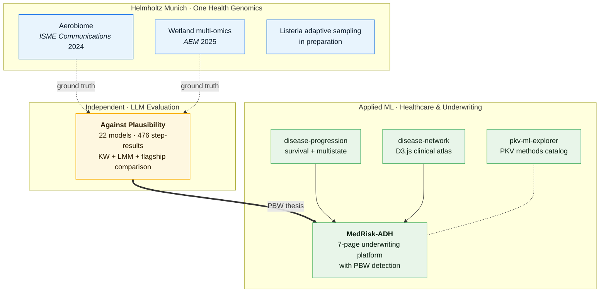

# Tim Reska

**Research Scientist · LLM Evaluation · Genomics & AI Infrastructure**

3 years evaluating LLMs. 22 models across GPT, Claude, and Gemini families, validated against my own peer-reviewed bioinformatics pipeline. I know where AI works, where it fails, and how to help teams trust the difference.

PhD candidate at Helmholtz Munich and the Technical University of Munich (expected Jun 2026), working on One Health genomic surveillance, long-read metagenomics, and large language model evaluation for scientific workflow construction. Founding member of an international AI research group; 4+ years building laboratory and computational infrastructure from scratch across 7 international sites; published in *ISME Communications*, *Nature Communications*, and *Molecular Systems Biology*.

Within the broader [GenomicsForOneHealth](https://github.com/ttmgr/GenomicsForOneHealth) collection (One Health group at the University of Zurich, supervised by [Lara Urban](https://sites.google.com/view/urban-lab/home)), my main contributions are in environmental metagenomics and food safety.

Links: [Email](mailto:timreska@gmail.com) · [LinkedIn](https://linkedin.com/in/tim-r-ai) · [ORCID](https://orcid.org/0009-0001-9700-5128)

## Portfolio at a glance

The peer-reviewed bioinformatics pipelines on the left double as ground truth for the independent LLM evaluation in the centre. The same "plausible but wrong" failure mode that emerged from that evaluation is then operationalized in the applied-ML portfolio on the right — most explicitly in MedRisk-ADH.

## Research focus

My work combines sampling strategy, nanopore sequencing, and reproducible bioinformatics for pathogen surveillance across air, water, food, and clinical settings. A second line of work examines whether large language models can produce bioinformatics workflows that remain scientifically valid beyond superficial code correctness.

## Featured benchmark

[`Against Plausibility: LLM Evaluation`](./llm-eval/) is the clearest benchmark in this repository for testing whether modern LLMs can build a real scientific workflow rather than just produce locally plausible code. It evaluates 28 entries across **476 scored step-results** using two validated nanopore pipelines as ground truth (a 7-step aerobiome workflow and a 10-step multi-omics wetland workflow).

*Wetland pipeline (10 steps × 28 evaluated entries). The light columns on the right (Step 7 RNA virome, Step 8 eDNA metabarcoding) are where every model in every family fails.*

*Flagship comparison: GPT-5 vs Opus 4.6 / Sonnet 4.6 vs Gemini 3 Pro / 3.1 Pro. Differences are not statistically significant on aerobiome despite large effect sizes — the bottleneck is benchmark statistical power, not family advantage.*

The benchmark is designed around sequential failure: wrong tools, wrong parameters, broken output chaining, and analytically indefensible choices that look competent at first glance. That makes it relevant not only to bioinformatics, but also to AI labs, agent teams, and technical consultancies interested in workflow reliability rather than demo-level code generation.

## Repository context

This repository is the polished personal counterpart to the broader [GenomicsForOneHealth](https://github.com/ttmgr/GenomicsForOneHealth) collection. The material here emphasizes project overviews, study-linked pipeline documentation, and benchmark interpretation, while the group repository retains collaborative project metadata, accession context, helper scripts, and wider One Health coverage.

If you need to decide across the wider group collection rather than the curated subset here, use the canonical [GenomicsForOneHealth Pipeline Selector](https://ttmgr.github.io/GenomicsForOneHealth/).

| Section | Scope | Connection |
|:---|:---|:---|
| [`llm-eval/`](./llm-eval/) | `Against Plausibility: LLM Evaluation` | Structured LLM benchmark for sequential scientific workflow construction |
| [`pipelines/aerobiome/`](./pipelines/aerobiome/) | Air metagenomics pipeline overview | First-author workflow paired with the group repository's [Air Metagenomics](https://github.com/ttmgr/GenomicsForOneHealth/tree/main/Environmental_Metagenomics/Air_Metagenomics) study materials |
| [`pipelines/wetland-surveillance/`](./pipelines/wetland-surveillance/) | Wetland multi-omics surveillance workflow | Shared first-author workflow paired with the group repository's [Wetland Health](https://github.com/ttmgr/GenomicsForOneHealth/tree/main/Environmental_Metagenomics/Wetland_Health) study materials |
| [`pipelines/listeria-adaptive-sampling/`](./pipelines/listeria-adaptive-sampling/) | Food-safety adaptive sampling workflow overview | First-author project overview paired with the group repository's [Listeria Adaptive Sampling](https://github.com/ttmgr/GenomicsForOneHealth/tree/main/Food_Safety/Listeria-Adaptive-Sampling) pipeline scaffold |
| [GenomicsForOneHealth](https://github.com/ttmgr/GenomicsForOneHealth) | Group-wide One Health pipeline collection | Environmental metagenomics, food safety, clinical, veterinary, eDNA, viability, and collaborative project infrastructure |
| [`disease-progression/`](./disease-progression/) | Disease progression modeling framework | Survival analysis, competing risks, and transformer architectures on longitudinal EHR data for risk quantification |
| [`disease-network/`](./disease-network/) | Interactive clinical atlas | D3.js dashboard for exploring disease state transitions and underwriting scenarios |
| [`pkv-ml-explorer/`](./pkv-ml-explorer/) | PKV ML framework reference explorer | Interactive catalog of ML and actuarial methods (logistic regression, random forest, LSTM, autoencoder, Z-score/Mahalanobis, life tables, survival analysis, agentic AI) for private health insurance workflows |
| [`medrisk-adh/`](./medrisk-adh/) | AI underwriting with failure mode detection | 7-page Streamlit platform with PBW detection, conformal validation, German Krankentagegeld module, and 8 real-world data adapters (NHANES / UK Biobank / CDC PLACES / …) |

Within the group collection, my main contributions are in environmental metagenomics and food safety: [Air Metagenomics](https://github.com/ttmgr/GenomicsForOneHealth/tree/main/Environmental_Metagenomics/Air_Metagenomics), [Wetland Health](https://github.com/ttmgr/GenomicsForOneHealth/tree/main/Environmental_Metagenomics/Wetland_Health), and [Listeria Adaptive Sampling](https://github.com/ttmgr/GenomicsForOneHealth/tree/main/Food_Safety/Listeria-Adaptive-Sampling).

## Selected projects

### Against Plausibility: LLM Evaluation

A structured LLM evaluation benchmark of 28 evaluated entries and **476 scored step-results across two independent ground-truth pipelines** — a 7-step linear aerobiome pipeline (Reska et al. 2024, *ISME Communications*) and a 10-step, 4-track multi-omics wetland surveillance pipeline (Perlas\*, Reska\* et al. 2025, *Applied and Environmental Microbiology*). Each model response is scored on tool choice, parameter accuracy, output compatibility, scientific validity, and executability under sequential workflow construction.

A separate statistical layer applies Kruskal-Wallis across model families, linear mixed models for repeated measures across pipeline steps, and a flagship comparison between the strongest entries from each family — finding flagship models statistically indistinguishable on aerobiome but with large effect sizes, indicating benchmark statistical power as the current bottleneck rather than family advantage.

This benchmark is designed to expose a failure mode that matters in real technical deployments: outputs that are plausible at the single-step level but unstable, incompatible, or analytically wrong once chained into a full workflow. **No model in any family produces a fully correct 10-step wetland pipeline**, and three of those steps have zero fully-correct answers across all 28 evaluated entries.

Links: [Pipeline overview](./llm-eval/) | [Evaluation framework](./llm-eval/methodology/evaluation_framework.md) | [Curated findings](./llm-eval/evaluations/summary.md) | [Reference pipeline](./pipelines/aerobiome/)

### Air monitoring by nanopore sequencing

First-author workflow for long-read metagenomic characterization of bioaerosol communities collected by liquid impingement. The personal repository documents the validated pipeline structure, while the paired group repository retains accession context, preprocessing notes, helper scripts, and execution details tied to the published study.

Links: [Pipeline overview](./pipelines/aerobiome/) | [Study repository and metadata](https://github.com/ttmgr/GenomicsForOneHealth/tree/main/Environmental_Metagenomics/Air_Metagenomics) | [Publication](https://doi.org/10.1093/ismeco/ycae058)

### Real-time genomic pathogen, resistance, and host range characterization from passive water sampling of wetland ecosystems

Shared first-author workflow integrating DNA shotgun metagenomics, RNA viromics, avian influenza whole-genome sequencing, and vertebrate eDNA metabarcoding across 12 wetlands in Germany, France, and Spain along the East Atlantic Flyway. The local overview emphasizes analytical design; the group repository retains sample mapping, accession references, and workflow-specific operational context.

Links: [Pipeline overview](./pipelines/wetland-surveillance/) | [Study repository and metadata](https://github.com/ttmgr/GenomicsForOneHealth/tree/main/Environmental_Metagenomics/Wetland_Health) | [bioRxiv DOI](https://doi.org/10.1101/2025.09.05.674394) (AEM 2025)

### Listeria adaptive sampling

First-author food-safety workflow for Oxford Nanopore adaptive sampling of *Listeria monocytogenes* from complex microbiome samples. The personal repository provides a project-level analytical overview, while the group repository retains the full script scaffold, installation notes, execution guide, and adaptation details for matched adaptive-sampling versus native-run comparisons.

Status: manuscript in preparation.

Links: [Pipeline overview](./pipelines/listeria-adaptive-sampling/) | [Study repository and metadata](https://github.com/ttmgr/GenomicsForOneHealth/tree/main/Food_Safety/Listeria-Adaptive-Sampling)

### Disease progression modeling

A reproducible Python framework for predicting patient trajectories through discrete disease states using survival analysis and deep learning. Ingests synthetic FHIR bundles via Synthea, transforms them to an OMOP-lite schema, and benchmarks Cox PH, multistate Markov chains, DeepSurv, DeepHit, and SurvTRACE (transformer-based competing-risks survival) against two clinical tracks: cardiovascular disease and Type 2 diabetes. Includes fairness auditing, model cards, a GDPR/EU AI Act regulatory context document, and a full pytest suite.

Stack: Python 3.10+, PyTorch, lifelines, pycox, scikit-survival, hmmlearn, FHIR.resources.

Links: [`disease-progression/`](./disease-progression/)

---

### Interactive clinical atlas

A standalone browser dashboard built in vanilla JavaScript (D3.js, Chart.js) for visualising disease state transitions and comparing intervention scenarios in a German medical underwriting context. Eight disease nodes with evidence-linked uncertainty bands, patient profile controls, and timeline/network/trajectory views. No framework dependencies — the entire application ships as a single HTML entry point.

Stack: ES6 modules, D3.js, Chart.js, HTML5, CSS3.

Links: [`disease-network/`](./disease-network/)

---

### PKV ML framework explorer

A self-contained browser dashboard cataloguing the machine-learning and actuarial methods relevant to German private health insurance (PKV) underwriting and portfolio management. Covers logistic regression, random forest, LSTM, autoencoder, Z-score and Mahalanobis outlier detection, actuarial life tables, moving average and exponential smoothing, survival analysis, and an agentic AI orchestration layer — each with problem framing, worked example, and trade-offs. Written in German; single HTML entry point with no build step.

Stack: vanilla HTML5, CSS3, JavaScript (no framework dependencies).

Links: [`pkv-ml-explorer/`](./pkv-ml-explorer/)

---

### MedRisk-ADH — AI underwriting with failure mode detection

A 7-page Streamlit application demonstrating a validation layer for automated underwriting. The core idea: automated underwriting AI fails most dangerously not when it is obviously wrong, but when it is **confidently wrong on low-quality data** (the plausible-but-wrong failure mode). The platform computes a Data Quality Score (DQS) for each patient before inference and flags cases where model confidence exceeds what the input data can actually support.

The risk-model suite covers XGBoost classification, Cox PH survival, CTMC multistate progression, an actuarial rating engine, and a German Krankentagegeld (sickness-absence) module — routed by a model selector to the appropriate case type. The validation layer pairs DQS with Calibration-Confidence Mismatch, Epistemic Prediction Uncertainty, conformal prediction intervals, distribution-shift detection, and a per-prediction reliability head. An underwriting layer turns model output into Standard / Substandard / Decline decisions with clinical-rule checks and temporal constraints, while a governance layer maintains an append-only audit log and human-override workflow.

A GDPR-safe multi-market synthetic cohort generator (DE / FR / ES / INT profiles with controlled degradation) drives reproducible failure-mode experiments, and 8 real-world adapters (NHANES, UK Biobank, BioLinCC, Zenodo, CDC PLACES, data.gov, Glucose-ML, Granada T1D) enable validation against public clinical datasets. 231 tests across 37 files keep the library reproducible.

Stack: Python 3.11+, Streamlit, XGBoost, lifelines, PyTorch, SHAP, conformal-prediction tooling, Plotly, reportlab, python-pptx.

Links: [`medrisk-adh/`](./medrisk-adh/)

---

## Selected publications

- Reska T, Pozdniakova S, Urban L. [Air monitoring by nanopore sequencing](https://doi.org/10.1093/ismeco/ycae058). *ISME Communications* (2024).
- Perlas A, Reska T, Sanchez-Cano A, et al. [Real-time genomic pathogen, resistance, and host range characterization from passive water sampling of wetland ecosystems](https://doi.org/10.1101/2025.09.05.674394). *Applied and Environmental Microbiology* (2025, shared first authorship).
- Urban L, Perlas A, Francino O, et al. [Real-time genomics for One Health](https://doi.org/10.15252/msb.202311686). *Molecular Systems Biology* (2023).
- Sauerborn E, Corredor NC, Reska T, et al. [Detection of hidden antibiotic resistance through real-time genomics](https://www.nature.com/articles/s41467-024-49851-4). *Nature Communications* (2024).
- Varzanadi AR, Reska T, et al. Environmental screening detects *Batrachochytrium dendrobatidis*. *Global Ecology and Conservation* (2025, contributing author).

A fuller publication record is available on [LinkedIn](https://linkedin.com/in/tim-r-ai).

## Methods and technical areas

- Long-read sequencing workflows for environmental, food-safety, and clinical surveillance
- Bioinformatics pipeline development in Snakemake, Python, and Bash
- Taxonomic classification, de novo assembly, adaptive sampling, AMR detection, virome analysis, and eDNA metabarcoding
- Benchmark design and failure analysis for LLM-generated scientific workflows and agentic pipeline construction

## Contact

[timreska@gmail.com](mailto:timreska@gmail.com)
