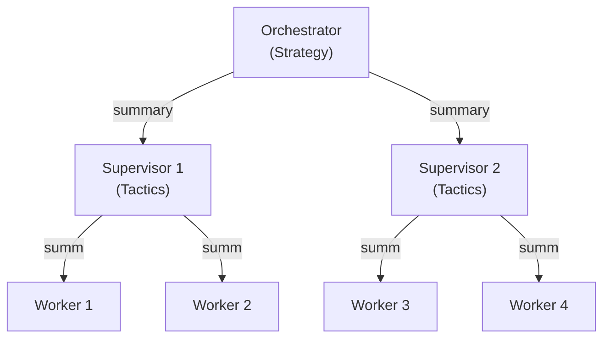
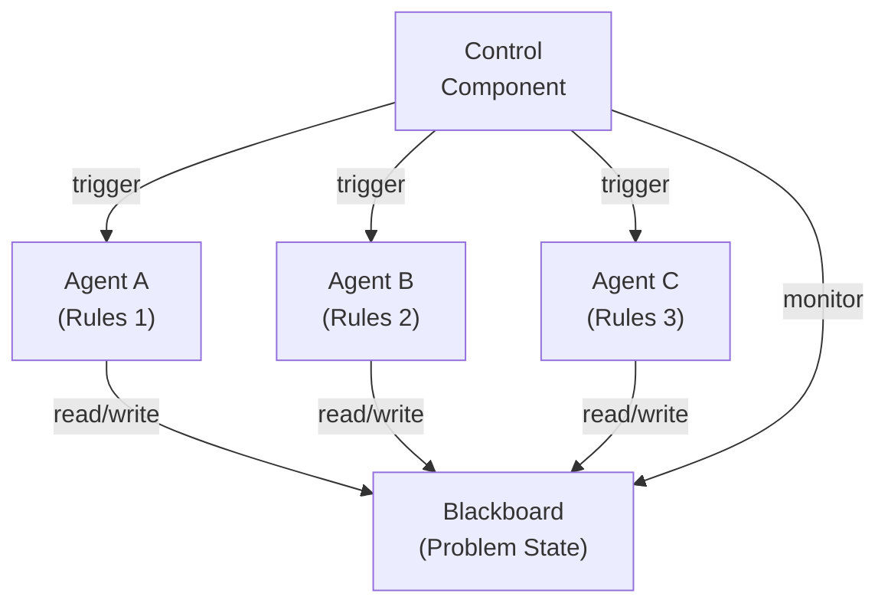
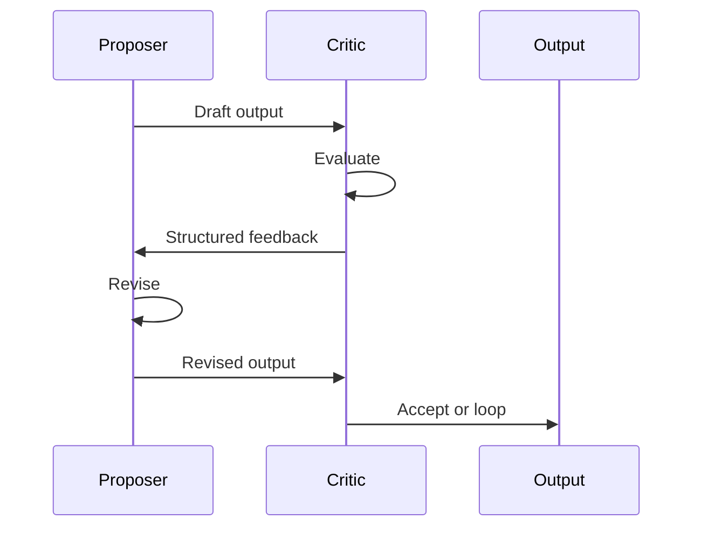
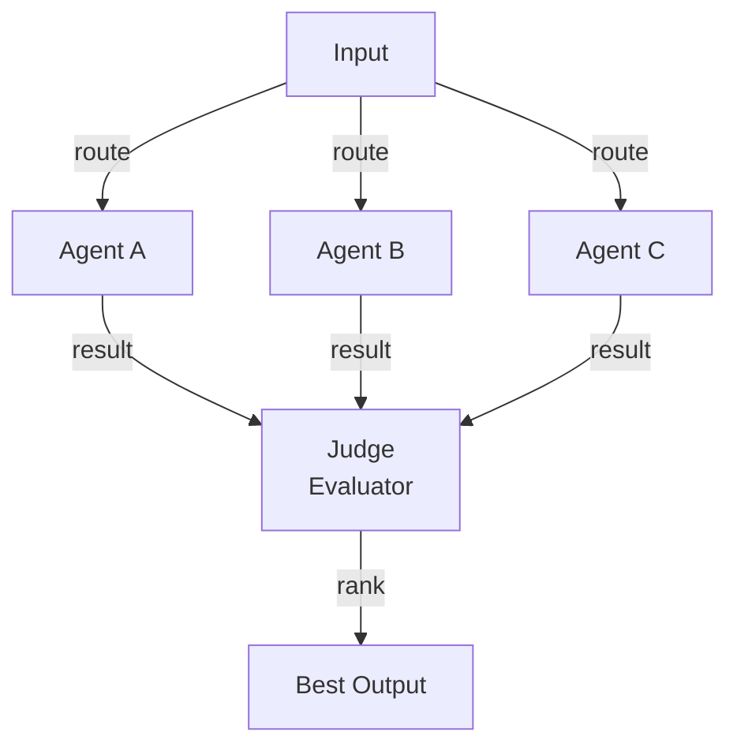
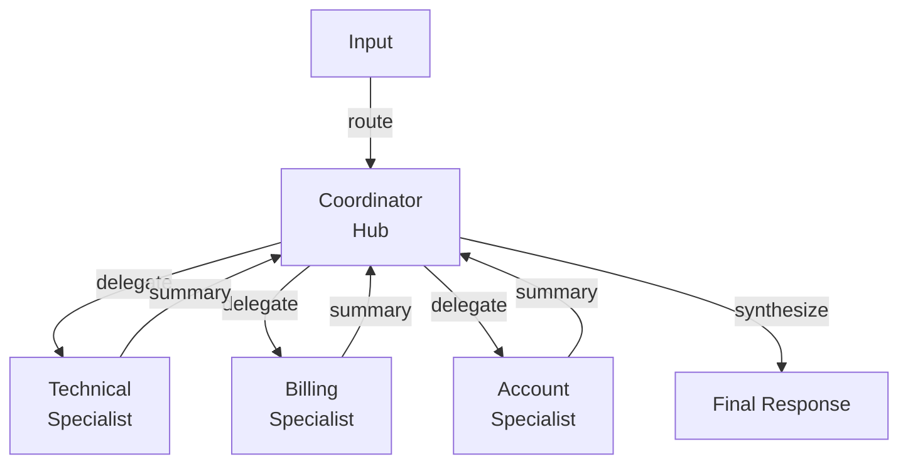
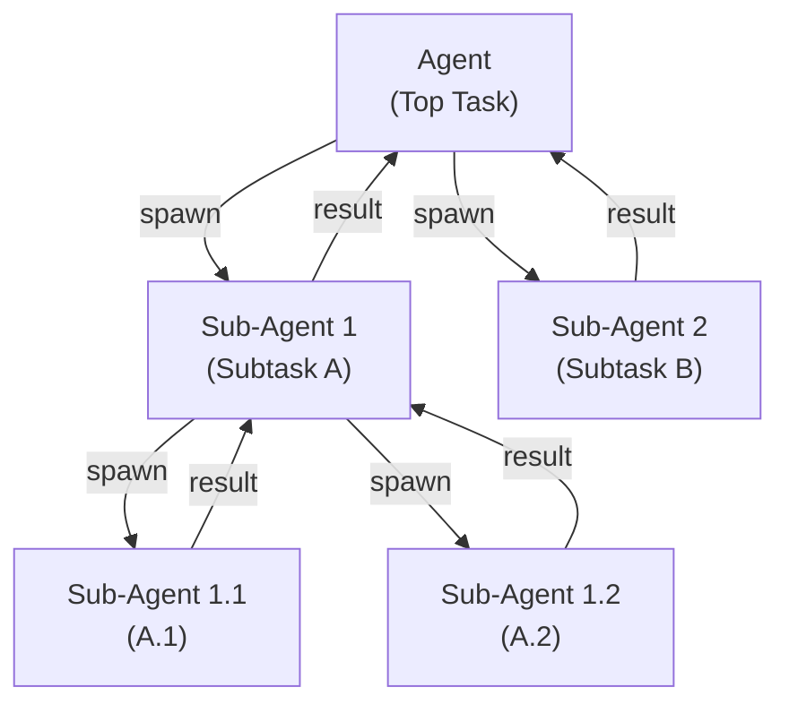
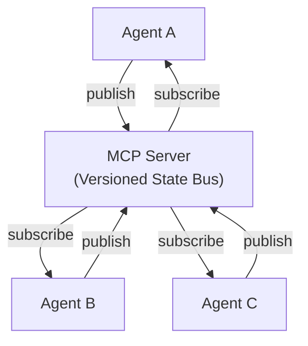
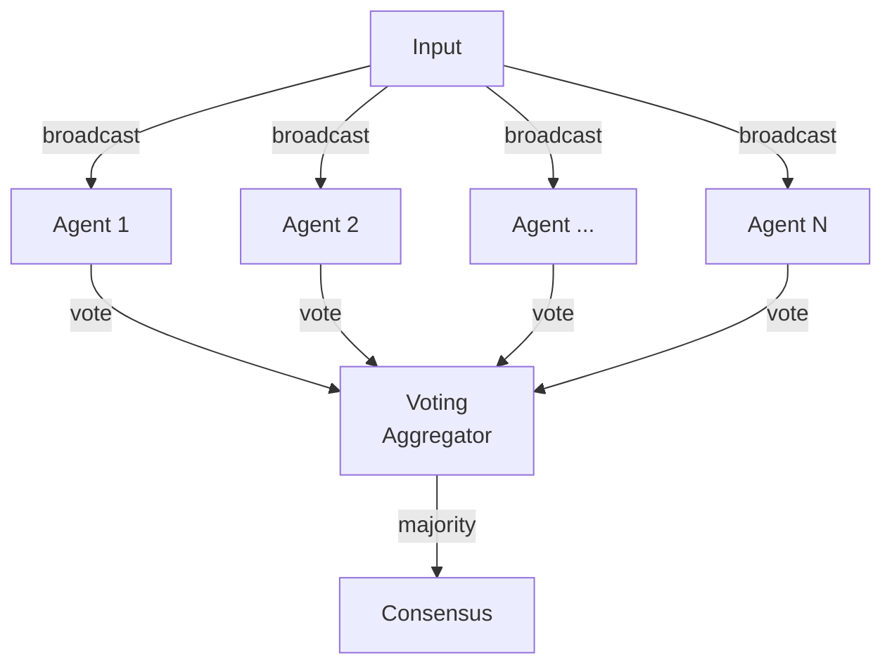
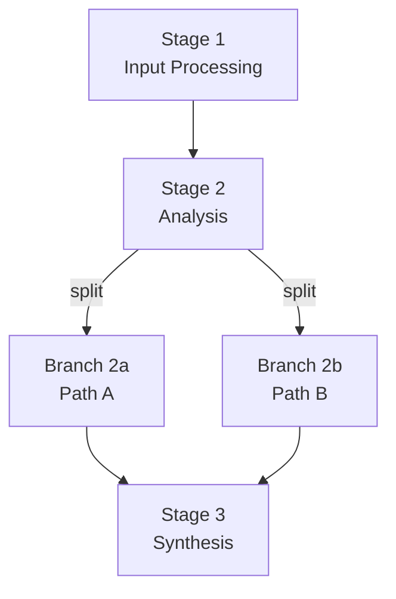

Frontier Primer · Personal Briefing · 2026-05-23

# What's actually possible with Claude agentic systems


Not a recap of the five orchestrators you already run. A map of the edge cases beyond them — primitives, topologies, shipments, ambient automation, optimization, frontier case studies, and a candid audit of where your own pipelines can push harder.

**This page was produced by 7 Haiku 4.5 agents fanned out in parallel** — the same single-message subagent pattern your `/48-dd-multi-agent`, `/42-askeras-ai-enablement`, and `/49-multi-agent-science` skills use. Each Haiku researched one slice of the frontier and wrote to `agentic_systems/research/`. Opus 4.7 synthesized them into this primer. The architecture is the demonstration.

1.  [The primitive map](#primitives)
2.  [Topology gallery beyond fan-out](#topologies)
3.  [Anthropic shipments, Oct 2025 → May 2026](#shipments)
4.  [Ambient automation: hooks, MCP, settings](#ambient)
5.  [Cost & speed optimization patterns](#optimization)
6.  [Push-the-limit case studies](#cases)
7.  [Your existing pipelines, audited](#audit)
8.  [Frontier cheatsheet](#cheatsheet)

## 1 · The primitive map

Every primitive Claude exposes today, grouped by whether your five orchestrator skills already lean on it. The terracotta-edged cards are routine for you; the gray-edged cards are mature primitives sitting unused — each one is a door you have not yet opened.

### In your kit already

#### Skills

Reusable agent instructions in `SKILL.md` with YAML frontmatter, loaded on demand or by trigger heuristics.

**Unlocks:** declarative workflows that survive across sessions — your 36 installed skills are this primitive at work.

#### Subagents (Task tool)

Spawn isolated child agents in parallel with independent context, tools, and model.

**Unlocks:** Phase 1 A/B/C single-message fan-out across all three big orchestrators.

#### Hooks (Stop, UserPromptSubmit)

Shell scripts that fire at session lifecycle events — you already run `resume_checkpoint.sh` and `stop_checkpoint.sh`.

**Unlocks:** session-resume continuity and end-of-session git hygiene without manual prompting.

#### Plan Mode

Read-only sandbox where Claude proposes changes and waits for approval before touching disk. Shift+Tab cycles modes.

**Unlocks:** high-stakes refactors reviewed before execution — the mode this primer was planned in.

#### Extended Thinking

Adaptive reasoning step before responding; the orchestrator and validator phases of your Science skill use Opus + max thinking.

**Unlocks:** blind validators that reason through claims privately before grading them.

#### Prompt Caching (5-min TTL)

Stable prefixes reused across calls at 10% input cost. Default 5-minute window; 1-hour available at 2× write cost.

**Unlocks:** long system prompts that pay for themselves after one cache hit.

#### CLAUDE.md & Auto-Memory

Human-written and self-written persistent context that survives compaction and session boundaries.

**Unlocks:** 36 skills, your role profile, project checkpoints — all recalled without re-explaining each session.

### Doors you haven't opened

#### MCP Servers

Open-standard bridges to GitHub, Slack, Sentry, Postgres, Figma, internal APIs. 800+ official servers, 10,000+ public.

**Unlocks:** a DD skill that reads a target's GitHub activity live; a Science skill that queries Sentry for production-error context.

#### Computer Use

Claude controls mouse, keyboard, scroll, screenshots as a tool. Opus 4.7 ships native pixel coordinates at 2576px.

**Unlocks:** automating a manual SaaS workflow (Salesforce, EHR portals, regulatory submission UIs) without writing Selenium.

#### Files API + Citations

Upload PDFs once, reuse across calls with verbatim source citations anchored to page ranges.

**Unlocks:** a clinical-evidence skill where every claim is auto-cited to the exact PubMed PDF page — no manual fact-check.

#### Batch API

Queue requests, get 50% discount on input and output. Stacks with caching for ~95% combined savings on offline work.

**Unlocks:** overnight processing of 1,000 underwriting case files at half-price while you sleep.

#### Scheduled Routines (Cron)

CronCreate spins up remote agents on a schedule. RemoteTrigger fires them on demand from outside the session.

**Unlocks:** `/71-llm-coding-radar` running every Monday at 06:00 without your laptop being open.

#### Managed Agents (Sessions API)

Cloud-hosted agents with persistent filesystems, secure containers, multi-hour task execution. Launched 2026-04-08.

**Unlocks:** a DD pipeline that survives your laptop sleeping — the whole 1-week engagement runs server-side.

#### Tool Search (Deferred MCP)

Tool names load at session start; schemas hydrate only when Claude searches. Lets you wire 200+ tools without context bloat.

**Unlocks:** hooking every market-data vendor (FactSet, S&P, MSCI, Daloopa) into a DD skill without paying schema-token tax up front.

#### Structured Output (JSON Schema)

Schema becomes compiler-enforced grammar — the model cannot generate invalid JSON. GA on Opus 4.7 + Sonnet 4.6 + Haiku 4.5.

**Unlocks:** Phase-1/2/3 JSON artefacts in your skills become unconditionally parseable. No retry-on-malformed-JSON logic ever.

#### Compaction Hooks (PreCompact)

Fire just before context compaction — inject checkpoints, save intermediate state, preserve work across the boundary.

**Unlocks:** a Science skill that runs for 4+ hours without losing cached regression models when context compacts.

#### Permission Deny Rules

Glob/regex matchers in `settings.json` that prevent reading `.env`, `*.pem`, secrets. Per-tool deny lists.

**Unlocks:** running agentic pipelines on the Allianz medical-UW codebase without risk of credential exposure into chat.

#### Background Tasks

Move a subagent to background with pre-granted permissions. Continues autonomously; you get notified on completion.

**Unlocks:** launching a 30-minute Phase-1 fan-out and continuing foreground work — exactly what produced this primer.

#### 1-Hour Extended Cache TTL

Cache writes cost 2×, reads still 0.1×. Break-even at 2 reads. Shipped 2026-05-02. AWS Bedrock also exposes it.

**Unlocks:** a multi-step DD engagement where the firm context (target dossier, comps, methodology) caches once and is hit dozens of times across phases.

[→ Full Haiku-1 inventory with 25+ primitives](research/01_primitives.md)

## 2 · Topology gallery beyond fan-out

Your five skills converge on one orchestration pattern: parallel Sonnet fan-out (3–6 subagents in a single message) + Opus synthesis + blind Opus validator. It is a strong default. These are the topologies that beat it under specific constraints.

### 2.1 Hierarchical / Nested Orchestrators

A top-level orchestrator delegates to mid-level supervisors, each managing leaf-level workers. Layers communicate through summary compression; fault isolation at each layer.



**Beats fan-out when:** the problem has natural organizational boundaries (legal, medical, engineering) and coordination overhead in flat fan-out exceeds latency budget.

**Use case:** a buyer-side DD where one supervisor handles fact-base + comps and another handles market + competition, each spawning their own workers — saves orchestrator context from carrying all 6 fan-out children simultaneously.

### 2.2 Blackboard / Shared-State Pattern

Specialist agents read and write to a shared artifact. Agents self-select when their preconditions match the current state. No direct agent-to-agent messaging.



**Beats fan-out when:** agent execution order depends on what is already known, and agents should self-activate based on preconditions — adaptive, decoupled problem-solving.

**Use case:** medical underwriting where cardiology / nephrology / endocrine specialists each read a shared patient record and fire only when their domain constraints match.

### 2.3 Adversarial Pairs (Proposer / Critic)

Proposer produces a draft. Critic reads it and writes a structured critique. Proposer revises; cycle repeats until quality gates are met.



**Beats fan-out when:** output correctness is paramount and one-shot agents drift toward confident wrongness through pattern-matching.

**Use case:** your blind Phase-3 validator already *is* this pattern's single-pass variant. The frontier move: loop it. Let the proposer revise after critique, then re-validate. Multi-round adversarial validation is how Anthropic ships Constitutional AI training.

### 2.4 Competitive Ensembles (Best-of-N + Judge)

N agents (different models or prompt variants) solve the same problem in parallel. An independent judge agent ranks outputs and selects the best.



**Beats fan-out when:** output quality varies with model/prompt and you have budget for N+1 calls but need reliability guarantees.

**Use case:** draft three competing investment recommendations (bullish / bearish / contrarian Opus instances) on the same target; let a fourth Opus judge rank them. Surfaces the strongest argument rather than the average one.

### 2.5 Hub-Spoke Routing

A coordinator agent owns full context and routes requests to specialist agents based on input type. Spokes never communicate directly; coordination flows through the hub.



**Beats fan-out when:** routing is deterministic (if intent=X → dispatch to Y specialist) and a single traceable control flow matters more than parallel throughput.

**Use case:** `/78-multi-agent-qc` already runs this — one router per nav hub node. Generalisable to a customer-support skill: classifier picks the specialist; specialist responds; hub stitches.

### 2.6 Recursive Sub-Agents

An agent decides at runtime how many and which sub-agents to spawn, inducing an execution tree. Sub-agents may spawn further children based on complexity signals.



**Beats fan-out when:** task decomposition is unknown upfront and the count + content of children must be chosen by policy at runtime.

**Use case:** a Science skill where the reviewer agent decides mid-run that a methods claim warrants spawning a sub-reviewer to fetch the cited paper and re-evaluate. Depth is policy-driven, not hard-coded.

### 2.7 MCP-Mediated Cross-Agent State

Agents coordinate via an MCP server acting as a versioned event bus. They publish state changes and subscribe to others — no direct messaging, full auditability.



**Beats fan-out when:** agents are heterogeneous, state must be durable, and auditability matters — or when stateful bottlenecks need horizontal scaling.

**Use case:** a multi-day DD where parser, classifier, enrichment, and validator agents publish to a shared MCP bus. The whole pipeline can pause, resume, and replay from any version checkpoint.

### 2.8 Swarm + Voting (Large-N Consensus)

Dozens to hundreds of agents solve the same problem with slight variation (prompt, temperature). Majority or weighted vote determines the output — no judge.



**Beats fan-out when:** N is large enough that majority vote is statistically robust and accuracy through consensus outweighs cost.

**Use case:** fact-checking a regulatory claim with 30 Haiku agents using different search strategies; high consensus (25+ agree) flags as verified. Affordable because Haiku.

### 2.9 Long-Running Agents with Checkpoints

An agent executes a multi-hour or multi-day workflow, writing checkpoints after each logical unit. On failure, resumes from last checkpoint. Tool calls must be idempotent.


**Beats fan-out when:** work spans hours, requires human-in-the-loop review mid-run, or crosses infrastructure boundaries where failures are expected.

**Use case:** Anthropic's own long-running-agents pattern: initializer creates 200+ test cases + feature list JSON + `init.sh`; subsequent sessions read git history as memory and pick up where left off. Multi-day feature development without a single 8-hour context.

### 2.10 Pipeline with Mid-Stream Branching

Sequential pipeline where early stages produce inputs for later stages, but at decision points the pipeline splits into parallel sub-branches, then reconverges.



**Beats fan-out when:** early-stage decisions determine which parallel subproblems to solve. Static fan-out wastes effort on irrelevant branches.

**Use case:** a Science reviewer that reads a manuscript, decides at the discussion section to spawn parallel sub-reviewers for (a) figure extraction (b) statistics validation (c) claims cross-reference, then reconverges. Different manuscripts trigger different branching.

[→ Full Haiku-2 report with topology selector decision tree](research/02_topologies.md)

## 3 · Anthropic shipments, Oct 2025 → May 2026

Eight months of shipments that matter for agentic-systems builders. Verified by Haiku-3 against primary sources. The throughline: agents graduated from "can Claude do this task?" to "can Claude regulate itself within budget and learn from experience?"

Q2 2026 — last 30 days

2026-05-06

Managed Agents "dreaming" — self-improving memory

Autonomous agents reason about their own decision patterns across multi-session traces without human annotation. First step toward production meta-learning. <a href="https://releasebot.io/updates/anthropic/claude" target="_blank">source</a>

2026-05-02

Prompt-caching TTL tiers ship (5-min + 1-hour)

1-hour cache costs 2× to write, still 0.1× to read; break-even at 2 hits. Long-context RAG pipelines now affordable at commodity cost. <a href="https://www.finout.io/blog/anthropic-api-pricing" target="_blank">source</a>

2026-04-22

MCP official registry crosses 800 servers

Table-stakes ecosystem size reached; third-party middleware (gateways, auth brokers) now viable. 10,000+ public + 3,000+ private servers in the broader space. <a href="https://www.qcode.cc/mcp-servers-ecosystem-2026" target="_blank">source</a>

2026-04-16

Claude Opus 4.7 — 1M context, native pixel coords, task budgets

Computer-use workflows manipulate screenshots at native resolution. Task budgets (beta) let agents self-regulate spend per loop. New tokenizer adds ~35% tokens vs 4.6. Sampling parameters removed. <a href="https://platform.claude.com/docs/en/about-claude/models/whats-new-claude-4-7" target="_blank">source</a>

2026-04-08

Claude Managed Agents — production launch

Cloud-hosted stateful sessions with persistent filesystems and secure containers. Notion / Rakuten / Asana ship production agents 10× faster than self-hosted. <a href="https://www.anthropic.com/news/managing-agents" target="_blank">source</a>

Q1 2026 (January–March)

2026-03-02

Claude Memory — chat-based memory becomes free-tier

Persistent context across turns without subscribing to Team or hand-managing markdown. Memory compaction automatic during storage. <a href="https://releasebot.io/updates/anthropic/claude" target="_blank">source</a>

2026-02-17

Claude Sonnet 4.6 — adaptive thinking + 1M context

Cost-aware reasoning depth per task; Opus-class coding at Sonnet price (\$3/\$15 per MTok). Per-token ROI optimization for batch and scheduled agents. <a href="https://www.anthropic.com/news/claude-opus-4-6" target="_blank">source</a>

2026-02-04

Claude Opus 4.6 + structured output GA

Adaptive thinking replaces fixed extended-thinking budgets. Schema enforcement shifts from prompting guarantee to compiler guarantee. <a href="https://www.anthropic.com/news/claude-opus-4-6" target="_blank">source</a>

2026-02 (late)

Claude Code Hooks become production-ready

5 hook types × 25+ lifecycle points. Shell, HTTP, MCP-tool, prompt, and agent hooks. Deterministic linters, approval gates, and cost-tracking run outside the model's control flow. <a href="https://code.claude.com/docs/en/hooks" target="_blank">source</a>

2026-01 (late)

Claude Code Plan Mode (`/plan`)

Three permission modes (Default / Auto-Accept / Plan), Shift+Tab cycles. Complex refactors separate analysis from execution. <a href="https://www.getaiperks.com/en/ai/claude-code-plan-mode" target="_blank">source</a>

2026-01 (early)

Workspace-level prompt-cache isolation

Multi-tenant SaaS can cache per-customer context without cross-tenant leakage. Shared billing no longer forces shared cache scope. <a href="https://www.finout.io/blog/anthropic-api-pricing" target="_blank">source</a>

Q4 2025 (October–December)

2025-12-18

Agent Skills open standard at agentskills.io

SKILL.md becomes an interoperable convention across Claude, Cursor, Codex, Gemini CLI. Skills become portable like npm packages. <a href="https://www.verdent.ai/guides/claude-skills-announcement-news" target="_blank">source</a>

2025-12-17

Message Batches API — GA

50% discount on input and output for 24-hour-latency workloads. Cost-sensitive bulk inference shifts from bespoke to standard. <a href="https://www.anthropic.com/news/message-batches-api" target="_blank">source</a>

2025-11-24

Claude Opus 4.5 — flagship; 200k context, extended thinking

Sustained reasoning on long-horizon tasks. Extended thinking enables first-principles problem solving without intermediate API calls. <a href="https://medium.com/@ZombieCodeKill/claude-opus-4-5-released-9e9bd9a32ad9" target="_blank">source</a>

2025-10-22

Claude Code on the web

Browser-native agentic workflows at claude.com. Skills, hooks, plan mode, slash commands, MCP — all surfaces now equivalent. <a href="https://mlq.ai/news/anthropic-launches-claude-code-on-the-web/" target="_blank">source</a>

2025-10-16

Claude Code Skills launch

Custom markdown workflows with triggers, examples, and tool allowlists. Prompt engineering becomes declarative. Non-engineers can define workflows without writing Python. <a href="https://simonwillison.net/2025/Oct/16/claude-skills/" target="_blank">source</a>

2025-10-15

Claude Haiku 4.5 — \$1/\$5 per MTok

One-third Sonnet 4.5 cost at 73.3% SWE-bench. High-volume classification, routing, and summarisation at \< \$0.001 per task. <a href="https://medium.com/@leucopsis/claude-haiku-4-5-review-4ac12a103275" target="_blank">source</a>

2025-09-29

Claude Sonnet 4.5 — best-in-class coding agent

Industry-standard benchmarks reachable at half Opus cost. Coding agents pivot from Opus-only to Sonnet-affordable. Default on Claude.ai and Claude Code. <a href="https://max-productive.ai/blog/claude-sonnet-4-5-announcement-2025/" target="_blank">source</a>

[→ Full Haiku-3 timeline with 17+ entries and key sources](research/03_shipments.md)

## 4 · Ambient automation: hooks, MCP, settings

The layer under your IDE — scripts and servers that fire silently before, during, and after every turn. Your `resume_checkpoint.sh` and `stop_checkpoint.sh` are the entry point; this is the rest of the room.

### Hook types worth wiring

Hooks receive JSON on stdin and emit decisions or context on stdout. Five core events:

- `SessionStart` — boot-time context injection, MCP cache priming
- `UserPromptSubmit` — block dangerous prompts, warn on main branch, inject project state
- `PreToolUse` — deny `rm -rf /`, `git push --force`, secrets exfil
- `PostToolUse` — auto-format after Edit/Write, lint, type-check, run tests
- `Stop` — checkpoint to memory, verify git clean, notify external systems

#### Block force-push and hard reset before they fire

```bash
# PreToolUse hook
TOOL=$(jq -r '.tool_name' <<< "$HOOK_PAYLOAD")
CMD=$(jq -r '.tool_input.command // empty' <<< "$HOOK_PAYLOAD")
if [[ "$TOOL" == "Bash" ]] && [[ "$CMD" =~ ^git.*(reset|push).*(--force|--hard) ]]; then
  echo '{"hookSpecificOutput":{"hookEventName":"PreToolUse","permissionDecision":"deny","permissionDecisionReason":"Force push/reset requires manual confirmation"}}'
fi
```

#### Auto-format Python files after every Write

```bash
# PostToolUse hook, matcher: "Write"
FILE=$(jq -r '.tool_input.file_path')
case "$FILE" in
  *.py) ruff check --fix "$FILE" 2>&1; black "$FILE" 2>&1 ;;
  *.ts|*.tsx|*.js) npx prettier --write "$FILE" 2>&1 ;;
esac
```

#### Auto-checkpoint at session Stop

```json
{
  "hooks": {
    "Stop": {
      "command": "/usr/local/bin/post-session.sh",
      "timeout": 30000
    },
    "PostToolUse": {
      "command": "bash -c 'npm run lint:fix || true'",
      "matcher": "Edit|Write",
      "timeout": 60000
    }
  }
}
```

### MCP servers worth installing

Browse <a href="https://claude.ai/directory" target="_blank">claude.ai/directory</a>. Current recommended tier for your workflows:

- **GitHub** — implement features from issues, review PRs without leaving the session
- **Slack** — read threads, post status, surface messages as resources
- **Sentry** — analyse production errors during debugging
- **PostgreSQL** — query data and inspect schemas (read-only role recommended)
- **Figma** — reference design tokens as resources, generate CSS from specs
- **PubMed / FactSet / S&P** — domain data for your Clinical Evidence and DD skills

<!-- -->

```bash
# Install GitHub MCP (HTTP, PAT-authenticated, user scope)
claude mcp add --scope user --transport http github \
  https://api.githubcopilot.com/mcp/ \
  --header "Authorization: Bearer ${GITHUB_TOKEN}"

# Custom stdio server (your own Python tool)
claude mcp add --transport stdio my-tool -- python3 /path/to/server.py
```

### settings.json power keys

```json
{
  "permissions": {
    "allow": ["Bash:grep", "Bash:find", "Bash:git status", "Read", "Edit"],
    "deny": ["Bash:rm", "Bash:git push --force", "Bash:sudo"]
  },
  "env": {
    "GITHUB_TOKEN": "ghp_...",
    "MAX_MCP_OUTPUT_TOKENS": "50000",
    "ENABLE_TOOL_SEARCH": "auto:5"
  },
  "effortLevel": "high",
  "model": "claude-opus-4-7",
  "hooks": { /* ... */ }
}
```

5 ambient automations to add today

1.  **SessionStart logger** — log every session boot to `~/.claude/session-log.jsonl` (model, cwd, sessionTitle). Enables "resume last Friday's work" and audit trails.
2.  **PreToolUse git guard** — deny force-push and hard-reset; prompt only for genuinely dangerous commands.
3.  **PostToolUse Python linter** — auto-run `ruff check --fix` and `mypy` on every `.py` Write. Catches type errors mid-turn.
4.  **User-scoped MCP trio** — GitHub + Slack + Sentry at `scope: user` means every project gets them without per-project setup.
5.  **Auto-format on Edit/Write** — prettier (JS/TS) or black (Python) on every file edit. Keeps style consistent without per-turn nudges.

[→ Full Haiku-4 deep dive on hooks, MCP, and settings.json](research/04_ambient.md)

## 5 · Cost & speed optimization patterns

The levers, ordered by impact. Pattern-level only — no Tim-specific numbers because we have no live billing telemetry. Sources verified against May 2026 pricing pages.

Model selection

Three-tier routing (Haiku 70% / Sonnet 20% / Opus 10%) delivers 50–80% cost reduction vs uniform Opus. Sonnet sits 1.2 pts below Opus on SWE-bench at 40% cheaper and 2× faster. Use Haiku for classification, routing, linting, scaffolding; Sonnet for implementation and review; Opus for multi-file refactors, architecture, deep reasoning (GPQA Diamond: Opus 91.3% vs Sonnet 74.1%).

Haiku for multi-file refactors or security review — reasoning falls off sharply at distance.

Prompt caching

Cache writes cost 1.25× (5-min) or 2× (1-hour); cache reads 0.1×. Break-even at 1 hit (5-min) or 2 hits (1-hour). On a 100K-token system prompt: \$0.625 to write, \$0.05 per hit — 92% saving. Cacheable: system prompts, tool definitions, document blocks, tool-use results. Place `cache_control` on the last stable block.

Caching content that changes per-request (timestamps, user input, per-call params) — the hash invalidates and you pay write cost with zero hits.

Batch API

50% off input and output for any workload tolerating 24-hour latency. Stacks with caching to ~95% combined savings. Bulk document review, dataset labeling, model eval, historical analysis, report synthesis. 10M/2M tokens on Sonnet: \$60 standard → \$30 batch.

Realtime chat, interactive agents, gating logic where the next step depends on the previous output.

Parallel fan-out

Independent subagent tasks — five Haiku triage agents at \$5 total beat one sequential Opus at \$25 per query. Wall-clock latency drops N-fold. Your Phase-1 A/B/C spawn already does this; extend to ingestion (Phases 0.5–0.7) and optional Phase 1.5 specialists.

Sequential dependencies — when agent-A's output is agent-B's required input, parallel wastes cost on agents that block waiting.

Context-window consolidation

1M-context Opus 4.7 wins when \>100K tokens must stay coherent (legal review across 500 pages, full DD case file). Cache the shared prefix (regulations, methodology) across reviews. One coherent call beats N chunks that lose cross-reference.

Independent small documents — separate calls cost less and don't suffer the 1M-context per-token premium. Empirical coherence degrades past ~200K tokens.

Deferred tool loading (ToolSearch)

When 20+ tools live in the session but the model calls 2–3. Schemas hydrate on demand. Critical for skills that should expose every market-data vendor, every internal API, without context bloat.

Small tool lists (\< 5 tools, \< 10K tokens of schemas) — the routing round-trip costs more than the schema savings.

Background execution

Truly parallel subagent orchestration, long-running offline tasks, batch submissions. Notification-driven continuation avoids polling and keeps the main agent responsive. This primer's 7-Haiku fan-out ran in background.

When the next routing or gating decision needs the result immediately.

Haiku-as-pre-filter

Route every incoming request through Haiku classification first. Routine queries (60–70% of volume) handled by Haiku; mid-complexity to Sonnet; hard escalated to Opus. On a million-request stream, ~\$1K vs full-Opus \$5M. Filter overhead amortizes to \< 1% on high volume.

Low request volume (\< 1K/month) — overhead exceeds savings. Or when Haiku misroutes hard tasks back to Opus, doubling cost on the worst cases.

[→ Full Haiku-5 report with verified pricing sources](research/05_optimization.md)

## 6 · Push-the-limit case studies

Twelve production deployments and frontier experiments from Nov 2025 – May 2026. Each verified against a primary URL. Picked for what they reveal about the pattern space.

#### Ramp · 300+ daily financial agents in production

2026-02 → 2026-04 · fintech · production scale

Single unified agent with thousands of fine-grained skills (replacing hundreds of specialized agents) automates expense classification, invoice matching, policy enforcement, month-end close — \> 99% accuracy across anomaly detection. Procurement and accounting agent fleets shipped in Feb and Apr.

**Primitives:** Skills (thousands, fine-grained, contextually loaded) + MCP integrations for live policy/transaction data + month-over-month iteration. <a href="https://cfotech.news/story/ramp-unveils-ai-accounting-agent-to-speed-month-end-close" target="_blank">source</a>

#### Notion · 2.8M custom agents deployed

2026-02 → 2026-05 · workspace tool · 1M+ user-built

Custom Agents shipped Feb 2026; within two months teams built \> 1M agents. Notion runs 2,800 internally — more agents than employees. Customers report 3× faster velocity, 70% cost reduction, ticket resolution from hours to minutes.

**Primitives:** declarative no-code agent definition + tight document/database/view API integration + Slack/Notion bidirectional sync + task routing between agents. <a href="https://www.notion.com/releases/2026-02-24" target="_blank">source</a>

#### Zapier · 800+ internal agents, 89% org adoption

2026-Q2 · distributed-org deployment

Agents across engineering, marketing, customer success, HR. 10× productivity on specific workflows. Continuous background execution via Zapier's scheduled-execution infra.

**Primitives:** MCP integration + Claude Skills as pattern libraries + background task execution + Slack/GitHub/CRM API wiring. <a href="https://claude.com/customers/zapier" target="_blank">source</a>

#### Anthropic · Agent Skills three-tier architecture

2026-Q2 · engineering blog · architecture pattern

Three-tier capability bundling: (1) YAML metadata + description, (2) full SKILL.md loaded on relevance, (3) contextually-loaded reference assets (PDFs, scripts, forms). PDF skill case study demonstrates capability expansion without system-prompt bloat.

**Primitives:** dynamic YAML discovery + code-execution sandbox (scripts run without loading into context) + progressive disclosure + evaluation-first methodology. <a href="https://www.anthropic.com/engineering/equipping-agents-for-the-real-world-with-agent-skills" target="_blank">source</a>

#### Anthropic · Long-running multi-session agent harness

2026-Q2 · engineering pattern

Two-phase architecture for agents that span multi-day work: (1) Initializer creates 200+ test cases, feature list JSON, and `init.sh`, commits baseline; (2) Coding Agent in subsequent sessions reads git history + progress files as memory, picks one feature, runs E2E tests via browser automation, commits incrementally. Git + structured progress files *are* the agent's memory across context windows.

**Primitives:** 1-hour prompt-cache TTL + git history as deterministic context + Puppeteer for E2E validation + strongly-worded guards ("It is unacceptable to edit tests"). <a href="https://www.anthropic.com/engineering/effective-harnesses-for-long-running-agents" target="_blank">source</a>

#### Claude Managed Agents · production launch

2026-04-08 · cloud platform

Cloud-hosted agentic service. Early adopters (Notion, Rakuten, Asana) ship production agents 10× faster than self-hosted. Stateful sessions, persistent filesystems, secure containers, multi-minute → multi-hour task execution.

**Primitives:** server-managed session persistence + uniform harness interface stable across model updates + rate limiting + cost controls + background task continuation across multiple LLM calls. <a href="https://www.anthropic.com/news/managing-agents" target="_blank">source</a>

#### Anthropic · 10-agent financial-services template suite

2026-05 · vertical templates

10 production-ready agents for pitchbook gen, KYC screening, month-end close, regulatory submissions, market research, risk assessment. Ship as Claude Code plugins, Cowork apps, or Managed Agent cookbooks. Pre-built MCP servers for FactSet, S&P Capital IQ, MSCI, PitchBook, Morningstar, LSEG, Daloopa.

**Primitives:** templated agent configs + pre-built MCP servers per vendor + prompt caching for multi-call sessions + PwC partnership for compliance/auditability + governed access controls. <a href="https://www.anthropic.com/news/finance-agents" target="_blank">source</a>

#### GitHub · 100+ subagent libraries cross-framework

2026-Q1 → Q2 · open-source ecosystem

wshobson/agents (82 plugins, 191 agents, 155 skills, 102 commands) — now consumed natively by Cursor, Codex CLI, Gemini CLI, OpenCode. VoltAgent/awesome-claude-code-subagents (100+ specialised subagents). awesome-claude-code-toolkit (#1 trending Feb 2026) aggregates 135 agents + 35 skills + 42 commands + 176+ plugins.

**Primitives:** SKILL.md as cross-framework convention + reusable subagent prompt format + GitHub Actions hooks for execution + community evaluation rubrics. <a href="https://github.com/wshobson/agents" target="_blank">source</a>

#### X/Twitter algorithm scoring subagent

2026-Q1 · solo developer · 4-day build

Developer reverse-engineered the X algorithm source over 4 days, built a Claude Code subagent that reads a draft tweet and scores it against algorithmic engagement patterns (reach, virality, platform friction) before posting. Wraps domain expertise (social-media strategy + algorithm behaviour) as a reusable subagent.

**Primitives:** Claude Code subagent (reusable prompt + skill bundle) + MCP server for Twitter API (Composio) + multi-page algorithm doc in context + iterative refinement loop. <a href="https://dev.to/septim_labs/i-read-the-x-twitter-algorithm-source-for-4-days-and-built-a-claude-code-sub-agent-that-scores-1ipb" target="_blank">source</a>

#### Ruflo · community multi-agent orchestration platform

2026-Q1 → Q2 · open-source · 100K+ MAU

Routes tasks across a swarm: simple ops (\< 1ms) to WebAssembly transforms, mid-complexity to Haiku/Sonnet, hard problems to Opus with multi-agent recursion. 250% improvement in effective token budget; 30–50% cost reduction. 100,000+ MAU across 80+ countries.

**Primitives:** heuristic-based triage before LLM invocation + MCP server architecture for plugin agents + structured shared context + recursive sub-agent spawning + WebAssembly tier for zero-LLM-cost deterministic ops. <a href="https://github.com/ruvnet/ruflo" target="_blank">source</a>

#### Prompt caching as silent backbone (and TTL shock)

2026-01 baseline → 2026-03 TTL change → 2026-05 AWS counter

Anthropic reduced default cache TTL from 60 minutes (Jan) to 5 minutes (Mar), increasing real-world costs 30–60% for production agentic deployments. AWS Bedrock responded by offering 1-hour TTL as an option. The episode revealed how infrastructure decisions at Anthropic ripple through the entire ecosystem.

**Primitives:** prefix-based cache matching + cost-accounting transparency + ecosystem competition (AWS counter-positioning on TTL). <a href="https://claude.com/blog/lessons-from-building-claude-code-prompt-caching-is-everything" target="_blank">source</a>

#### Ramp procurement agent fleet

2026-04 · purpose-built agent swarm

Specialised agents triage employee requests, source vendors via web search + internal databases, review contracts against policy templates, flag compliance issues. Communicate via a shared task queue; escalate ambiguous decisions to humans. Processing time from days to hours.

**Primitives:** multi-agent orchestration (one agent per workflow step) + shared memory across steps + human-in-the-loop escalation + spend-management API integration + web search for vendor discovery. <a href="https://www.prnewswire.com/news-releases/ramp-launches-fleet-of-ai-agents-across-its-procurement-platform-302756657.html" target="_blank">source</a>

Patterns repeating across the case studies

1.  **From many specialized agents to one agent with thousands of skills.** Ramp's pivot reflects a broader shift — agents are more navigable when skills are fine-grained, discoverable, and contextually loaded rather than burning context on static tool lists.
2.  **Prompt caching is the silent multiplier.** Every long-running production system depends on it. The March 2026 TTL change rippled through deployments, AWS competed on TTL, documentation of cache behaviour became critical.
3.  **Multi-session architecture requires deterministic memory.** Agents spanning multiple context windows use git history, structured progress files, and JSON feature lists as ground truth — not embeddings or chat history.
4.  **Skills are cross-framework currency.** SKILL.md works in Claude Code, Cursor, Codex, Gemini CLI. Standardised YAML metadata + shared evaluation rubrics make agent libraries portable.
5.  **Production agents need human-in-the-loop escalation.** Every large deployment includes an escalation path for ambiguous decisions. Not a limitation — a design choice that prevents silent failure.
6.  **MCP is the production-data layer.** 100M → 300M MCP downloads in 2025 reflect this: agents are only useful when they can read and write real systems.

[→ Full Haiku-6 report with 12 case studies](research/06_case_studies.md)

## 7 · Your existing pipelines, audited

Haiku-7 read all five SKILL.md files and surfaced three things per skill: where parallelism could be unlocked, where Opus could downgrade without quality loss, and where a phase could be skipped or merged. Pattern-level recommendations only — no diffs. The blind validator is explicitly off-limits everywhere.

### /48-dd-multi-agent

**(a) Parallelism unlock:** Phases 0.5, 0.6, 0.7 run sequentially despite zero interdependencies — interview synth, data fetcher, ingestion waves are independent. Collapse into a single parallel spawn. Saves ~3–5 min wall-clock per engagement.

**(b) Model downgrade:** Phase 0 calls Opus with max thinking for scope/brand/mode setup — mechanical work. Downgrade to Sonnet. Reserve Opus for Phase 2a/2b synthesis and Phase 3 validation (load-bearing).

**(c) Phase skip/merge:** Phase 0.6 and 0.7 both produce lightweight JSON consumed immediately in Phase 1. Consider merging into a single Data Fetcher with optional customer-context sub-task gated by engagement flag.

### /42-askeras-ai-enablement

**(a) Parallelism unlock:** Phase 0.5 ingestion and Phase 0.7 data fetcher run sequentially, but feed different knowledge pools and have zero mutual dependency — spawn both in the same message. Phase 1.5 specialists (EU AI Act, Vendor TCO, Sector benchmark) wait for Phase 1a/b/c to finish, but only depend on Phase 0 — start them in a wave-2 message alongside Phase 1.

**(b) Model downgrade:** Phase 0 (orchestrator model, mechanical setup) → Sonnet. Phase 2a fit-matrix and Phase 2b wave-plan stay Opus (genuine synthesis + scenario stress-testing). Validator never downgrades.

**(c) Phase skip/merge:** For non-regulator sides, Phase 1.5 Vendor TCO and Sector benchmark are truly optional — document the condition so they can be skipped for lean engagements without orchestrator overhead.

### /49-multi-agent-science

**(a) Parallelism unlock:** Phase 0.5 ingestion blocks Phase 1 — fire it as async/fire-and-forget while orchestrator prefills Phase 1a/b/c prompts in parallel, then await both. Phase 1 starts earlier and overlaps 0.5's runtime.

**(b) Model downgrade:** Model assignment is already near-optimal for reasoning load. Phase 0 Opus + max thinking is justified (it shapes all downstream work). Phase 1a/b/c Sonnet is correct. Phases 2a/2b and 3 (reviewer) and 4 (synthesis) all earn Opus + max thinking. No downgrades available without quality cost.

**(c) Phase skip/merge:** Phase 0.5 exists for messy inputs. For a clean drop (polished preprint + data summary), gate it explicitly — skip 0.5 when `inputs/` has \< 5 files. Saves 30–60 sec on clean engagements.

### /78-multi-agent-qc

**(a) Parallelism unlock:** Already maximised. Fan-out step 1 dispatches one Sonnet Explore per nav hub node in a single message; verification step 3 dispatches one Opus verifier per theme group, also single-message. No additional parallelism available within this topology.

**(b) Model downgrade:** Correct as-is. Sonnet for breadth, Opus only for verification ("a false-positive bug report is costly; pay for proof exactly where it matters"). Confirm theme-group aggregation is aggressive enough to avoid N Opus agents for N claims — for 100+ findings, target 5–8 verification agents.

**(c) Phase skip/merge:** The synchronous triage between fan-out and verification adds a prose round-trip. For large engagements, consider collapsing triage into verification — let the Opus verifier consume raw Sonnet findings and emit triage+verification in one pass. Trade-off: longer Opus prompt vs one fewer round-trip.

### /71-llm-coding-radar

**(a) Parallelism unlock:** Already maximised. Six cluster agents (Anthropic, OpenAI, Google, open-source, IDE/MCP, research) spawn in a single message. No additional fan-out available.

**(b) Model downgrade:** Fan-out agents use `subagent_type=general-purpose` with no explicit model. Confirm Sonnet, not Opus — for curation/research (WebSearch + WebFetch), Sonnet is sufficient. If accidentally Opus, downgrade.

**(c) Phase skip/merge:** For high-velocity weeks (100+ items), have one agent do synthesis directly from raw fan-out results, skipping the separate triage pass. 30 sec vs 3–5 min. Document as an option, not the default.

Cross-skill patterns to standardise

1.  **Phase-0 Opus is overkill across DD / Askera / Science.** "Restate target name, set env vars, confirm font choice" is mechanical. Push Phase-0 to Sonnet; reserve Opus for Phase 2a onward. Estimated ~15–20% reduction in Opus token budget per engagement.
2.  **Sequential Phase 0.X across DD / Askera is independent work.** Single-message parallel spawn saves 2–5 min per engagement. Science Phase 0.5 should gate on input messiness.
3.  **Blind validators are load-bearing — never downgrade them.** Three skills run Opus + max thinking for the Phase 3 validator; this is the single most consequential Opus call in each pipeline.
4.  **JSON schema duplication across DD / Askera / Science.** facts / assumptions / interpretations / key_risks / open_questions / confidence — nearly identical. Centralise in `_assets/schemas/multi-agent-shared.schema.json`; validate all three against it.
5.  **Ingestion as optional gate.** Science already has this candidate; DD and Askera could adopt the same pattern. Skip Phase 0.5 for thin drops; spawn async when present.

[→ Full Haiku-7 audit with per-phase references](research/07_audit.md)

## 8 · Frontier cheatsheet

When you want edge case X, reach for primitive Y + topology Z. Synthesized from all seven research streams.

I want a DD pipeline that survives my laptop sleeping for the whole 5-day engagement.

**Managed Agents** (cloud-hosted sessions) + **Long-running with checkpoints topology** + **1-hour prompt cache** for the firm-context prefix.

I want every clinical claim my Underwriting skill makes to be auto-cited to the source PDF page.

**Files API** (upload PDFs once) + **Citations API** (per-block attribution) + **Structured Output** (JSON schema with citation fields).

I want `/71-llm-coding-radar` to run every Monday at 06:00 without my laptop being open.

**CronCreate** (scheduled remote agents) + **Managed Agents** (server-side execution) + existing radar fan-out.

I want a Science manuscript audit where the reviewer can spawn sub-reviewers mid-run when a claim warrants deeper verification.

**Recursive sub-agents topology** + **Background tasks** (so the parent doesn't block) + **Tool Search** (so the sub-reviewer can hydrate the right MCP tools on demand).

I want to automate a manual SaaS workflow — say, bulk uploading underwriting decisions to the Allianz portal.

**Computer Use** (Opus 4.7 native pixel coords) + **Hub-spoke topology** (one coordinator dispatches per-record agents) + **Background tasks**.

I want overnight processing of 1,000 underwriting case files at minimum cost.

**Batch API** (50% discount, 24h latency) + **Prompt caching** (the shared methodology prefix) + **Haiku-as-pre-filter** (route only ambiguous cases to Sonnet/Opus).

I want the highest-quality recommendation on a controversial DD call.

**Competitive ensembles topology** (bullish / bearish / contrarian Opus instances) + a fourth Opus **judge**. N+1 cost for verified strongest argument.

I want my DD pipeline's Phase 0.5 / 0.6 / 0.7 ingestion to stop adding 3–5 minutes of wall-clock per engagement.

**Parallel fan-out** in a single message (the audit's \#2 cross-skill pattern). No new primitives needed — just collapse three sequential spawns into one.

I want a multi-day pipeline where parser, classifier, enrichment, and validator agents share state durably and the whole workflow is pause/resume/replay-able.

**MCP-mediated cross-agent state** (versioned event bus) + **Long-running checkpoints** + **Managed Agents** for the cloud-hosted persistence.

I want to stop accidentally running `git push --force` or accidentally reading `.env` from a target's codebase.

**PreToolUse hook** (denial logic) + **Permission deny rules** in settings.json (glob/regex on file patterns). Zero AI judgment — deterministic enforcement.

I want every Phase-1/2/3 JSON artefact in my skills to be parseable on the first try, every time.

**Structured Output** with JSON schema enforcement. Becomes a compiler guarantee, not a prompting guarantee. Removes "if parse fails then retry" logic from every skill.

I want my next Science skill to learn from its own past sessions — patterns of what worked, what got revised.

**Managed Agents "dreaming"** (self-improving memory, May 2026) + **file-system memory** + a Stop hook that writes structured retro notes to memory after every run.

**Provenance.** This primer was produced 2026-05-23 by Opus 4.7 synthesizing 7 Haiku 4.5 research agents running in parallel via `Agent` calls in a single message. Each Haiku wrote its findings to `agentic_systems/research/`; this page is the only synthesis pass. Total wall-clock from spawn to render: ~6 minutes. Architecture is the demonstration.

Source reports: [01_primitives.md](research/01_primitives.md) · [02_topologies.md](research/02_topologies.md) · [03_shipments.md](research/03_shipments.md) · [04_ambient.md](research/04_ambient.md) · [05_optimization.md](research/05_optimization.md) · [06_case_studies.md](research/06_case_studies.md) · [07_audit.md](research/07_audit.md)
