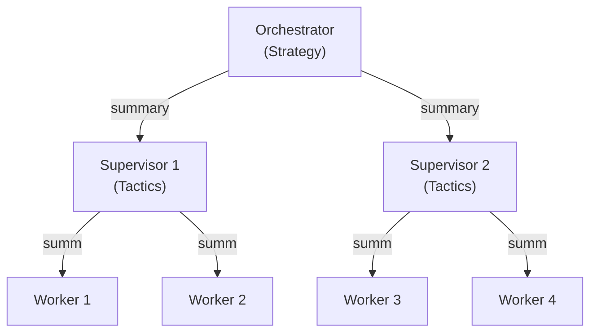
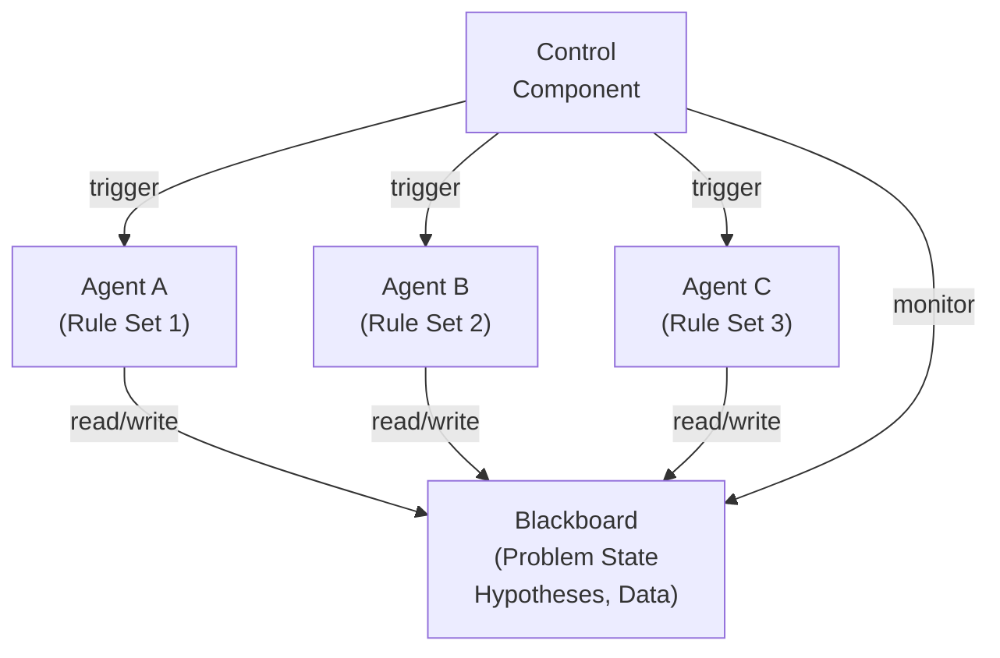
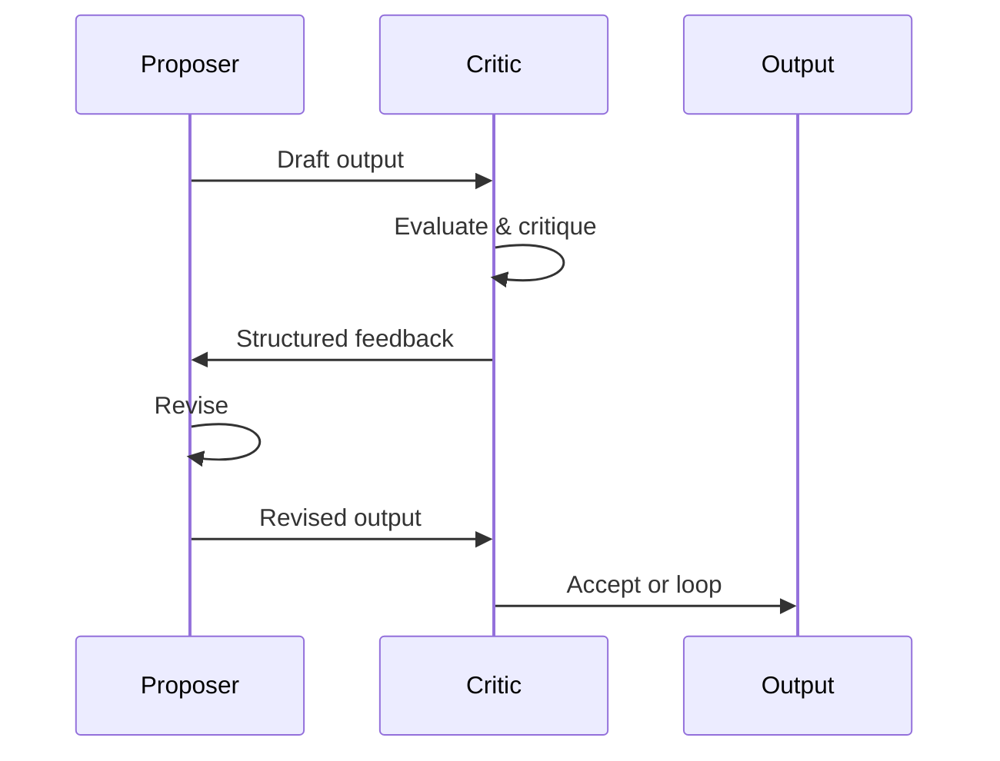
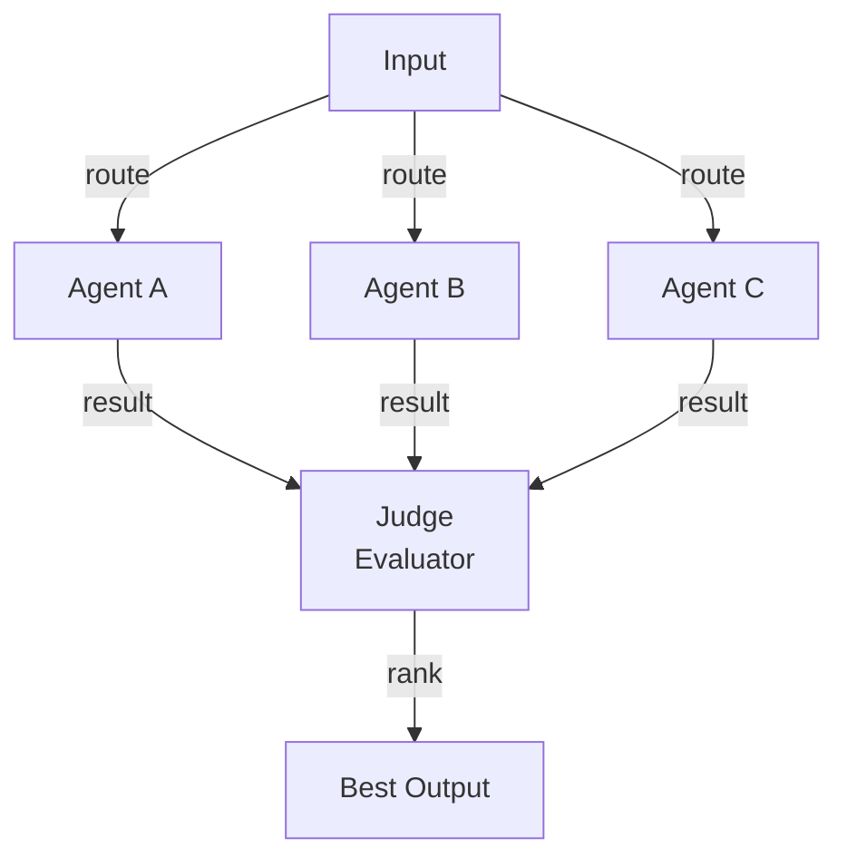
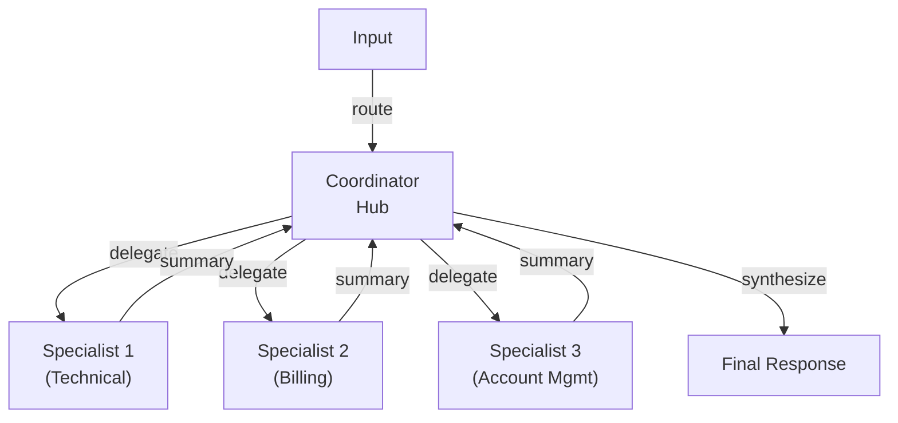
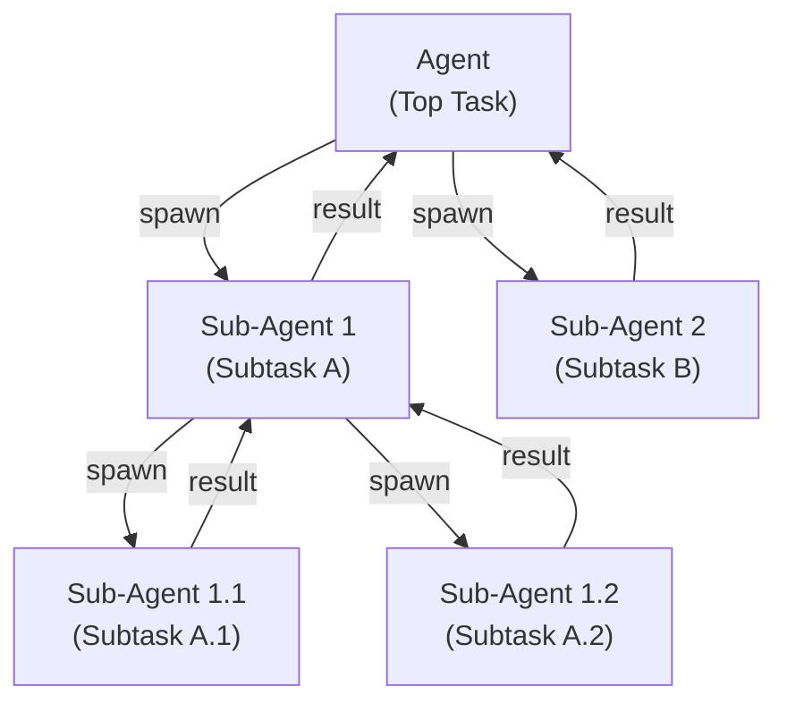
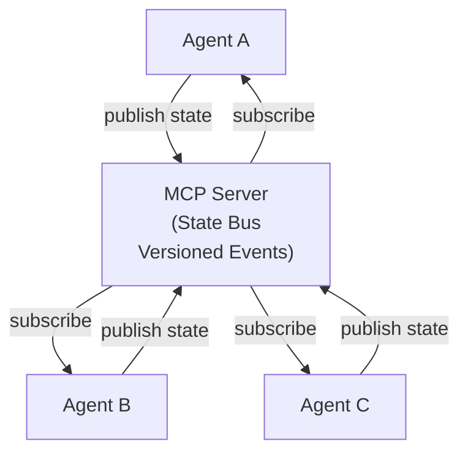
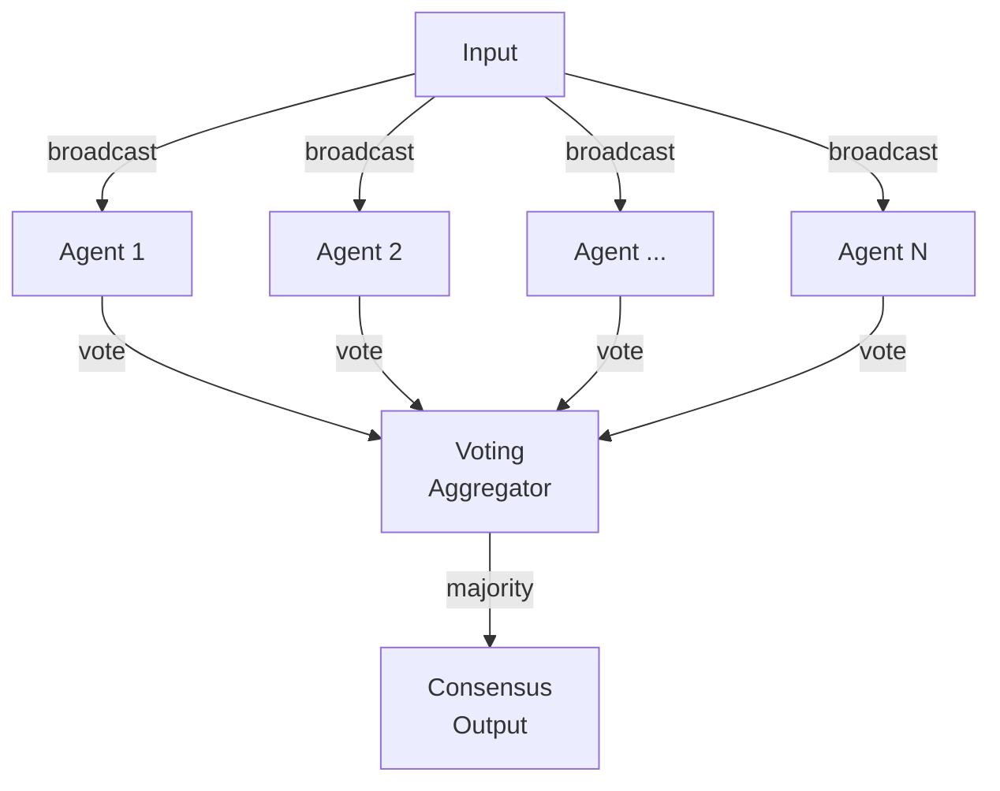
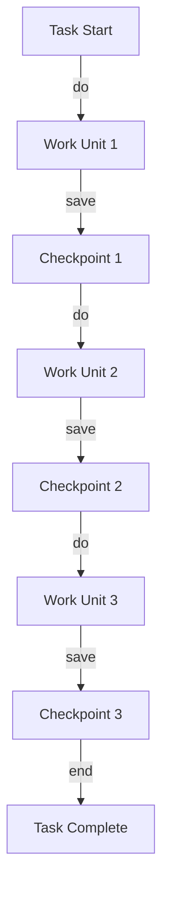
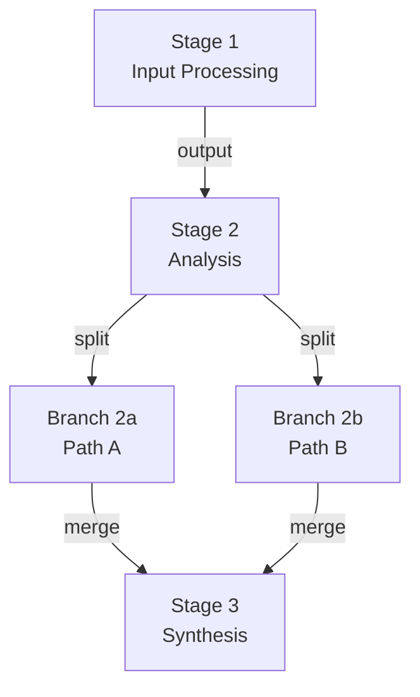

# Advanced Multi-Agent Orchestration Topologies

Beyond the parallel fan-out pattern (one orchestrator spawning isolated subagents, each in its own context window, returning compressed summaries), production agentic systems converge on specialised topologies when constraints demand it: tight state coupling, adversarial validation, large-N voting, recursive depth, or multi-day durability.

## 1. Hierarchical / Nested Orchestrators

A top-level orchestrator delegates to mid-level supervisor agents, who in turn manage teams of leaf-level workers. Layers communicate through summary compression—high-level agents handle strategy, lower layers handle tactical execution. Information flows up and down the tree, with fault isolation at each layer.

When the problem has natural organizational boundaries (e.g., legal review, medical coding, engineering systems audit) or when coordination overhead in flat fan-out exceeds latency budget.

Use case: Large-scale document classification pipelines where a router orchestrator delegates to domain supervisors (contracts, insurance claims, regulatory filings), each spawning domain-expert workers that extract structured fields and flag anomalies. [Source](https://learn.microsoft.com/en-us/agents/architecture/multi-agent-orchestrator-sub-agent)

## 2. Blackboard / Shared-State Pattern

Multiple specialist agents (knowledge sources) read and write to a shared, structured problem space called the blackboard. Agents self-select to act based on what is already known. A control component monitors the blackboard and triggers agents when their preconditions match the current state. No direct agent-to-agent communication; all coordination is through the shared artifact.

Use when agent execution order depends on what is already known and agents should self-select based on preconditions, enabling adaptive, decoupled problem-solving.

Use case: Medical diagnosis where different specialist agents (cardiology, nephrology, neurology) independently read a shared patient record (symptoms, lab values, imaging findings), each adding differential diagnoses or ordering tests based on pattern matching, until convergence. The order of agent activation is not predetermined; each agent fires when its domain constraints are met. [Source](https://callsphere.ai/blog/blackboard-architecture-multi-agent-systems-shared-knowledge-spaces)

## 3. Adversarial Pairs (Proposer / Critic)

One agent (proposer, generator) produces a draft output. A second agent (critic, discriminator) reads the output and writes a structured critique flagging unsupported claims, logical inconsistencies, and missing context. The proposer receives the critique, revises, and the cycle repeats until quality gates are met.

Use when output correctness is paramount and a single agent left unchecked will drift toward confident wrongness through pattern-matching rather than reasoning.

Use case: Code generation where a generator agent writes code and an adversarial security/architecture agent critiques for SQL injection vectors, hardcoded secrets, missing error handling, and performance bottlenecks. The generator revises and re-submits until the critic approves. [Source](https://jatinmishra27.medium.com/when-your-ai-needs-an-enemy-the-case-for-adversarial-agents-30a906b2273b)

## 4. Competitive Ensembles (N Agents, Best-of-N Judge)

N agents (potentially different models or prompt variants) solve the same problem in parallel. An independent judge agent evaluates all N outputs side-by-side and selects the best, or ranks them by quality. This is distinct from voting; the judge actively compares and ranks, not just counts votes.

Use when output quality varies with model/prompt and you have budget for N+1 calls but need guarantees—the judge overhead is worth the reliability gain.

Use case: Mathematical theorem proving where three different agent variants (different prompts, different models) attempt the same proof in parallel; a fourth judge agent compares proofs for rigor, elegance, and completeness, and returns the winner. [Source](https://github.com/NousResearch/hermes-agent/issues/479)

## 5. Hub-Spoke Routing (Coordinator + Specialists)

A single coordinator agent (hub) owns full context and routes requests to specialist agents (spokes) based on input type or intent. Spokes never communicate directly; all coordination flows through the hub. The hub stitches final outputs into a coherent response.

Use when routing logic is simple and deterministic (if intent=support → dispatch to support specialist), and you want a single traceable control flow.

Use case: Customer support chatbot where a router agent classifies each ticket by intent (billing, technical, account), then dispatches to a billing specialist, technical troubleshooter, or account manager. Each specialist has narrow context and focused tools; the router synthesizes their responses into a customer-facing answer. [Source](https://medium.com/@anmjawad007/designing-coordinator-agents-hub-and-spoke-architectures-for-reliable-ai-workflows-3cb6831d4a49)

## 6. Recursive Sub-Agents (Agents Spawning Agents)

An agent may decide at runtime how many and which sub-agents to spawn, inducing a rooted execution tree. Each node is an agent instance tackling a portion of the task. Sub-agents may themselves spawn child agents. Memory and constraints cascade down the tree; results aggregate upward.

Use when task decomposition is not known upfront and agents must adaptively decide which subproblems to delegate, with both count and content of child tasks chosen by policy at runtime.

Use case: Code generation for a complex feature where the main agent decides it needs a schema agent, a validation agent, and a test-generation agent. The schema agent spawns a types agent and a migrations agent. The tree unfolds based on complexity signals at each step. [Source](https://arxiv.org/pdf/2602.07072)

## 7. MCP-Mediated Cross-Agent State

Agents coordinate state through a Model Context Protocol (MCP) server rather than direct message passing. The MCP server acts as a central bus: agents register resources (files, database rows, API endpoints), others subscribe to changes, and state is versioned and event-sourced for auditability and replay. Agents never talk directly; they publish to the bus and consume from it.

Use in enterprise systems where agents are heterogeneous, state must be durable, and auditability matters—or when stateful session bottlenecks must be solved with horizontal scaling behind load balancers.

Use case: Multi-day document ingestion and classification pipeline where a parser agent publishes parsed documents to MCP, a classifier agent subscribes and publishes classifications, an enrichment agent subscribes and adds metadata, and a validator agent subscribes and flags anomalies. The MCP server versions all state changes and allows pause/resume of the entire workflow. [Source](https://a2a-mcp.org/blog/mcp-full-form)

## 8. Swarm + Voting (Large-N Consensus)

Dozens to hundreds of agents solve the same problem in parallel with slight prompt variations or temperature sampling. A majority or weighted vote determines the final output. Unlike competitive ensembles, no judge—consensus replaces ranking.

Use when accuracy through consensus outweighs cost, and when N is large enough that majority vote is statistically robust.

Use case: Fact-checking pipeline where 30 agents independently verify the same claim using different search strategies and reasoning chains. A voting aggregator tallies their verdicts (true/false/uncertain) with confidence scores. High-confidence consensus (25+ agents agree) flags as verified; low consensus triggers human review. [Source](https://fast.io/resources/consensus-protocols-multi-agent-systems/)

## 9. Long-Running Agents with Checkpoints

An agent executes a multi-day or multi-hour workflow, writing intermediate state (checkpoint) to durable storage after each logical unit of work. On failure, the agent resumes from the last checkpoint, not from the start. Event history is replayed to reconstruct context; tool calls are idempotent to ensure resumption doesn't duplicate side effects.

Use for any workflow spanning hours, requiring human-in-the-loop review mid-run, or crossing infrastructure boundaries where failures are expected.

Use case: Automated insurance claims processing where an agent ingests 500 claims, extracts structured fields, scores each claim, and flags anomalies for human review. After every 50 claims, it checkpoints to PostgreSQL. On infrastructure failure at claim 237, it resumes from checkpoint 200 and reprocesses claims 201–237 (idempotent tool design prevents duplicate payments). [Source](https://zylos.ai/research/2026-03-04-ai-agent-workflow-checkpointing-resumability)

## 10. Pipeline with Mid-Stream Branching

A sequential pipeline of agents where early stages produce outputs consumed by later stages, but at strategic decision points, the pipeline splits into parallel sub-branches (each spawning multiple agents), which then reconverge. The orchestrator is the memory hub, passing relevant summaries forward at each junction.

Use when early-stage decisions determine which parallel subproblems to solve, and you need the flexibility of a pipeline with the parallelism of fan-out at certain junctures.

Use case: Scientific literature review where a reader agent processes papers sequentially, at each paper decides whether to spin up parallel agents for (a) figure extraction, (b) methodology validation, (c) claims cross-reference, all in parallel, then reconverges to a synthesis agent that writes the review. Different papers trigger different branching patterns. [Source](https://www.agentpatterns.ai/agent-design/agent-composition-patterns/)

---

## Topology Selector

**If** your problem is large with natural organisational boundaries (contracts, billing, technical) → use **Hub-Spoke**. **If** agent execution order depends on what is already known and agents should self-activate → use **Blackboard**. **If** correctness requires adversarial challenge or you have budget for N+1 forward passes → use **Adversarial Pairs** or **Competitive Ensembles**. **If** your workflow spans hours/days and must survive failures → use **Long-Running Agents with Checkpoints**. **If** task decomposition is unknown upfront and highly adaptive → use **Recursive Sub-Agents**. **If** you need auditability, horizontal scaling, and heterogeneous agent coordination at enterprise scale → use **MCP-Mediated State**. **If** you need both sequential and parallel execution within a single workflow → use **Pipeline with Mid-Stream Branching**.

---

## Sources

- [Anthropic's 2026 Agentic Coding Report](https://news.bitcoin.com/anthropics-2026-agentic-coding-report-maps-the-rise-of-multi-agent-dev-teams/)
- [Multi-Agent in Production 2026: 3 Patterns That Survived](https://niteagent.com/blog/multi-agent-production-2026/)
- [Orchestrator and subagent multi-agent patterns](https://learn.microsoft.com/en-us/agents/architecture/multi-agent-orchestrator-sub-agent)
- [Agent Orchestration Patterns: Swarm vs Mesh vs Hierarchical](https://gurusup.com/blog/agent-orchestration-patterns)
- [Blackboard Architecture for Multi-Agent Systems](https://callsphere.ai/blog/blackboard-architecture-multi-agent-systems-shared-knowledge-spaces)
- [When Your AI Needs an Enemy — The Case for Adversarial Agents](https://jatinmishra27.medium.com/when-your-ai-needs-an-enemy-the-case-for-adversarial-agents-30a906b2273b)
- [Designing Coordinator Agents: Hub-and-Spoke Architectures](https://medium.com/@anmjawad007/designing-coordinator-agents-hub-and-spoke-architectures-for-reliable-ai-workflows-3cb6831d4a49)
- [AgentSpawn: Adaptive Multi-Agent Collaboration Through Dynamic Spawning](https://arxiv.org/pdf/2602.07072)
- [MCP & Multi-Agent AI: Building Collaborative Intelligence 2026](https://onereach.ai/blog/mcp-multi-agent-ai-collaborative-intelligence/)
- [AI Agent Workflow Checkpointing and Resumability](https://zylos.ai/research/2026-03-04-ai-agent-workflow-checkpointing-resumability)
- [Agent Composition Patterns](https://www.agentpatterns.ai/agent-design/agent-composition-patterns/)
- [Consensus Protocols for Multi-Agent Systems](https://fast.io/resources/consensus-protocols-multi-agent-systems/)
- [Best-of-N Competitive Evaluation — Judge-Based Selection](https://github.com/NousResearch/hermes-agent/issues/479)
