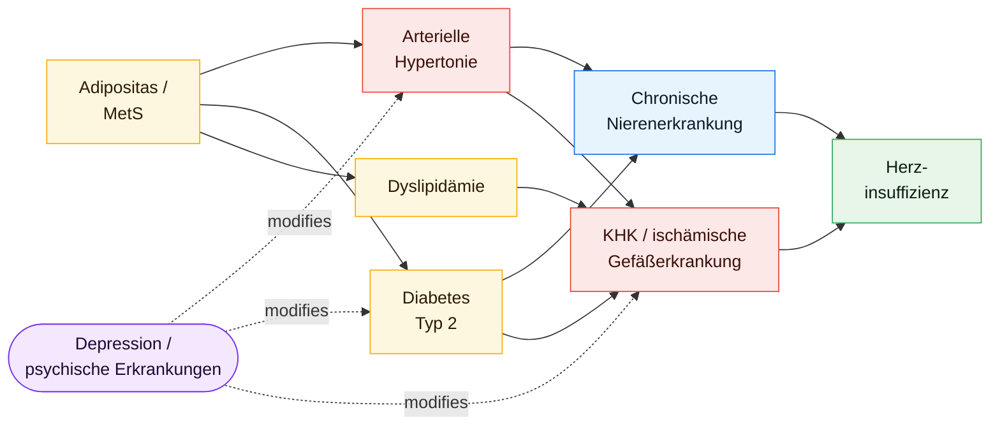

# Interactive Clinical Atlas

A standalone browser dashboard for exploring disease-state transitions and intervention scenarios in a German medical underwriting context. Eight interconnected disease nodes, evidence-linked uncertainty bands, patient-profile controls, and timeline / network / trajectory views — shipped as a single HTML entry point with zero build step.

## What this is

An educational, evidence-anchored simulation layer for understanding how cardiorenal, metabolic, and mental-health risk compounds across a patient trajectory. It is a companion visualization to the applied ML work in [`../disease-progression/`](../disease-progression/) (survival and multistate models) and [`../medrisk-adh/`](../medrisk-adh/) (underwriting platform with plausible-but-wrong detection).

## Run it

```bash
open index.html          # macOS
xdg-open index.html      # Linux
```

No build step, no dependencies to install. Works offline once the page is loaded.

## Disease nodes

Eight nodes were selected because they dominate the European underwriting risk picture and form a tightly coupled network (each node feeds and is fed by at least two others):



| Node | Network role |
|:-----|:-------------|
| Arterielle Hypertonie | Metabolic / cardiorenal gateway |
| Adipositas / Metabolisches Syndrom | Upstream driver |
| Diabetes mellitus Typ 2 | Central metabolic hub |
| Chronische Nierenerkrankung (CKD) | Cardiorenal endpoint |
| Dyslipidämie | Lipid pathway |
| KHK / ischämische Gefäßerkrankung | Atherosclerotic endpoint |
| Herzinsuffizienz | Cardiac endpoint |
| Depression / psychische Erkrankungen | Cross-system modifier |

All headline metrics are marked as educational model values with uncertainty bands. The tool is **not** intended for tariff calculation or clinical single-case decisions — it is a visualization and training instrument.

## Stack

Vanilla ES6 modules, [D3.js](https://d3js.org/) v7 for the network / timeline, [Chart.js](https://www.chartjs.org/) v4 for trajectory panels, HTML5 + CSS3. No framework dependencies, no bundler.

## Companion projects

- [`../disease-progression/`](../disease-progression/) — reproducible Python framework with Cox PH, DeepSurv, DeepHit, SurvTRACE, and multistate Markov models on the same clinical tracks.
- [`../medrisk-adh/`](../medrisk-adh/) — Streamlit platform that operationalizes these transitions into an underwriting decision with confidence-calibrated failure-mode flags.

## Language

Interface language is German (the target audience is the DACH underwriting market). Evidence tags and citations are in English. An i18n toggle is on the roadmap.
