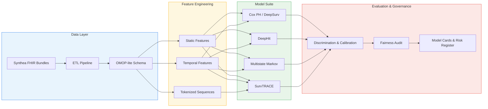
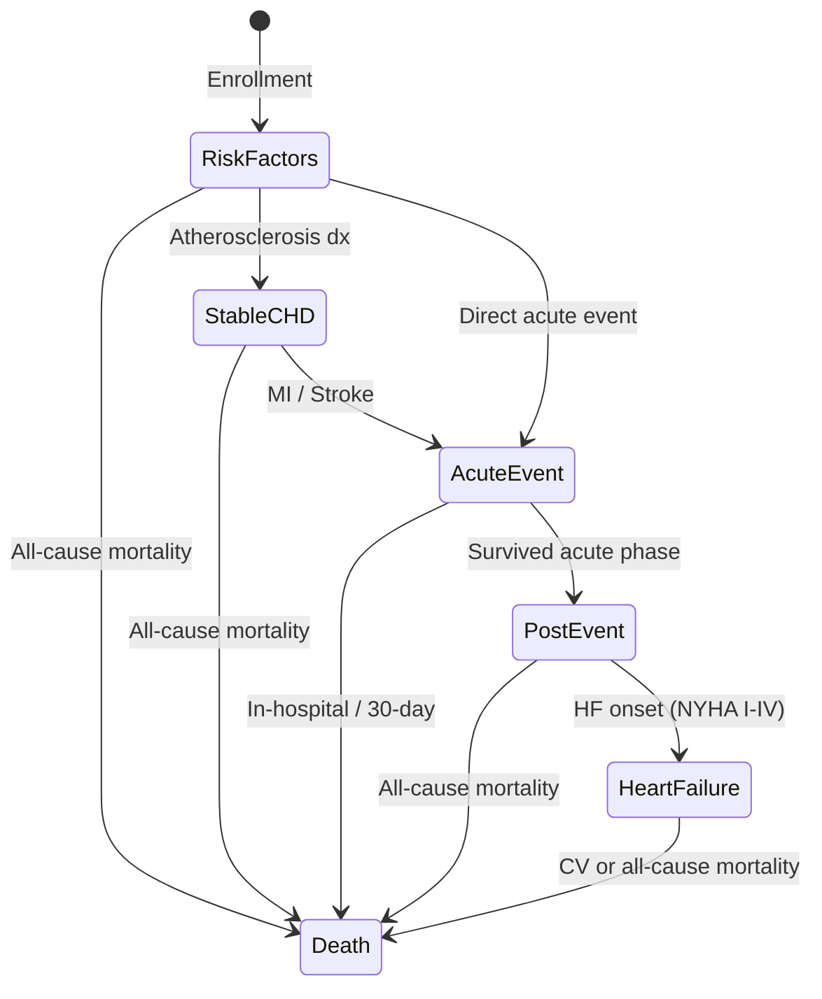
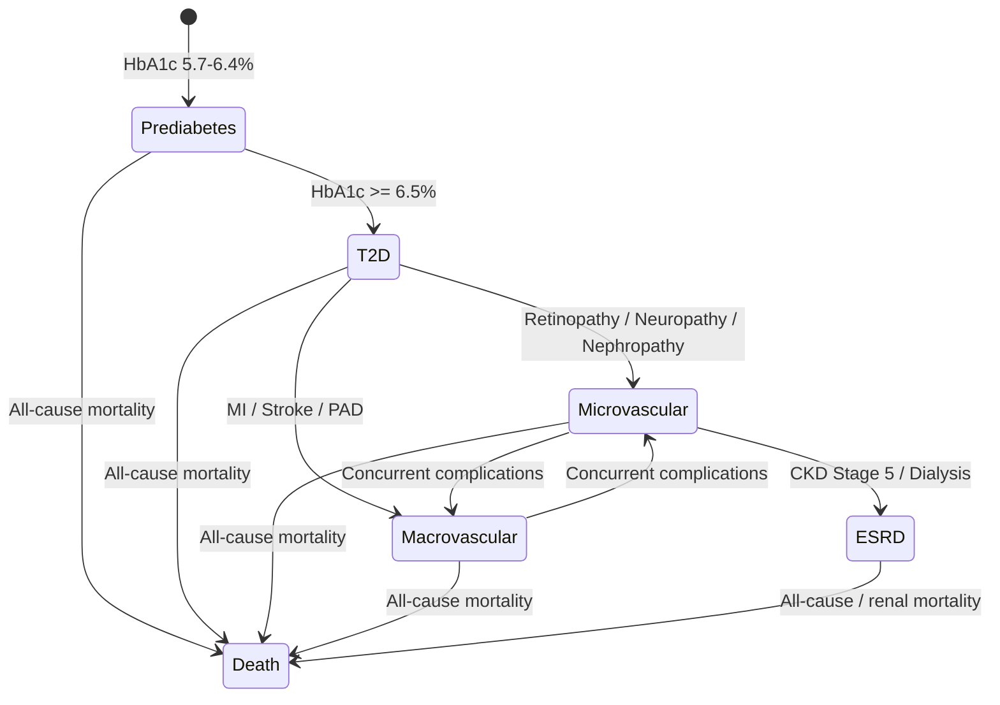

# Disease Progression Modeling

> Disease progression modeling for medical underwriting -- survival analysis, multistate models, and transformer architectures on longitudinal EHR/claims data.

[](https://www.python.org/downloads/)
[](LICENSE)
[](https://github.com/astral-sh/ruff)

---

## About

This project brings together **clinical disease progression modeling** and **actuarial risk quantification** into a single, reproducible framework. It was built by a researcher with a PhD in AI and metagenomics who is now applying deep sequence modeling, survival analysis, and probabilistic state machines to the healthcare and insurance domain.

The core question it answers: *Given a patient's longitudinal health record, how do we predict their trajectory through discrete disease states, estimate time to critical events, and translate those predictions into actionable risk scores for underwriting, pricing, and care management?*

The framework ingests synthetic FHIR bundles (via [Synthea](https://github.com/synthetichealth/synthea)), transforms them into an OMOP-lite analytic schema, engineers static, temporal, and tokenized feature sets, and benchmarks a suite of models ranging from classical Cox regression to transformer-based survival architectures.

Two clinical tracks are implemented end-to-end:

- **Cardiovascular disease (CVD)** -- from modifiable risk factors through acute coronary events to heart failure staging.
- **Type 2 diabetes (T2D)** -- from prediabetes through micro- and macrovascular complications to end-stage renal disease.

---

## Architecture



---

## CVD Track -- Multistate Model



---

## Diabetes Track -- Multistate Model



---

## Model Comparison

| Model | Approach | Competing Risks | Time-Varying Covariates | Interpretability |
|---|---|---|---|---|
| **Cox PH** | Semi-parametric proportional hazards | Cause-specific only | Yes (extended Cox) | High -- hazard ratios |
| **DeepSurv** | Neural network + Cox partial likelihood | Cause-specific only | Yes (with feature snapshots) | Medium -- SHAP / permutation |
| **DeepHit** | Discrete-time joint distribution over event type and time | Yes (native) | Limited (baseline features) | Medium -- feature importance |
| **Dynamic-DeepHit** | RNN encoder + DeepHit head on longitudinal inputs | Yes (native) | Yes (native) | Low-Medium -- attention weights |
| **Multistate Markov** | Continuous-time Markov chain with intensity matrix | Yes (absorbing states) | Yes (piecewise-constant) | High -- transition intensities, sojourn times |
| **SurvTRACE** | Transformer encoder for survival with competing events | Yes (native) | Yes (sequence input) | Medium -- attention maps, integrated gradients |

---

## Notebooks

Four self-contained notebooks, executable end-to-end on the synthetic cohort.

| # | Notebook | What it demonstrates |
|---|----------|----------------------|
| 00 | [`00_data_quality.ipynb`](notebooks/00_data_quality.ipynb) | Synthea → OMOP-lite ETL, cohort characterization, missingness profile across CVD and T2D tracks |
| 01 | [`01_cvd_progression.ipynb`](notebooks/01_cvd_progression.ipynb) | CVD multistate model end-to-end: Cox PH, DeepSurv, DeepHit, SurvTRACE benchmarked on the cardiovascular track |
| 02 | [`02_diabetes_progression.ipynb`](notebooks/02_diabetes_progression.ipynb) | T2D progression from prediabetes through micro/macrovascular complications to ESRD |
| 03 | [`03_business_view.ipynb`](notebooks/03_business_view.ipynb) | Translation layer: model outputs → underwriting scenarios, fairness audit, model card and risk-register artifacts |

---

## Quick Start

### Prerequisites

- Python 3.10 or later
- [uv](https://github.com/astral-sh/uv) (recommended) or pip

### Installation

```bash
# Clone the repository
git clone https://github.com/treska/disease-progression.git
cd disease-progression

# Install with uv (recommended)
uv pip install -e ".[dev]"

# Or with pip
pip install -e ".[dev]"

# Or use the Makefile
make install
```

### Generate Synthetic Data

```bash
# Generate 5,000-patient cohorts for both clinical tracks
make data

# Or manually
python -m disease_progression.data.synthea_loader --module cvd --n_patients 5000
python -m disease_progression.data.synthea_loader --module diabetes --n_patients 5000
```

### Run Notebooks

```bash
make notebooks
# Opens Jupyter with the analysis notebooks at http://localhost:8888
```

### Run Tests and Linting

```bash
make test    # pytest
make lint    # ruff
```

---

## Project Structure

```
disease-progression/
├── configs/
│   └── default.yaml              # Experiment configuration
├── notebooks/                    # Analysis and demonstration notebooks
├── src/
│   └── disease_progression/
│       ├── data/                 # Synthea loader, OMOP-lite ETL, codelists
│       ├── features/             # Static, temporal, and tokenized feature engineering
│       ├── models/               # Cox, DeepSurv, DeepHit, multistate, SurvTRACE
│       ├── evaluation/           # Metrics, calibration, fairness, model cards
│       └── governance/           # Risk register, data sheets, audit trail
├── tests/                        # Unit and integration tests
├── governance/
│   ├── model_cards/              # Auto-generated model cards per experiment
│   ├── risk_register.yaml        # ML risk register (EU AI Act aligned)
│   └── data_sheet.yaml           # Dataset documentation
├── pyproject.toml
├── Makefile
├── LICENSE
└── README.md
```

---

## Regulatory and Governance Notes (DACH Region)

This framework is designed with European regulatory requirements in mind:

- **GDPR Article 9** -- Health data is a special category under GDPR. All modeling uses synthetic data (Synthea) or requires explicit consent and a Data Protection Impact Assessment (DPIA) before processing real patient records.
- **GenDG (Gendiagnostikgesetz)** -- German law prohibits insurers from requesting or using genetic test results. The framework excludes genetic features by design and enforces this via feature-level access controls.
- **Swiss DSG (Datenschutzgesetz)** -- Switzerland's revised data protection act (effective Sep 2023) imposes GDPR-equivalent obligations for health data processing, including data minimization and purpose limitation.
- **EU AI Act** -- Medical underwriting models that influence access to insurance fall under high-risk AI systems (Annex III). The framework supports compliance through automated model cards, risk registers, fairness audits, and human-in-the-loop evaluation protocols.

See the [`governance/`](governance/) directory for model cards, the risk register, and the dataset data sheet.

---

## License

This project is licensed under the MIT License. See [LICENSE](LICENSE) for details.

---

Built with clinical rigor and actuarial intent.
