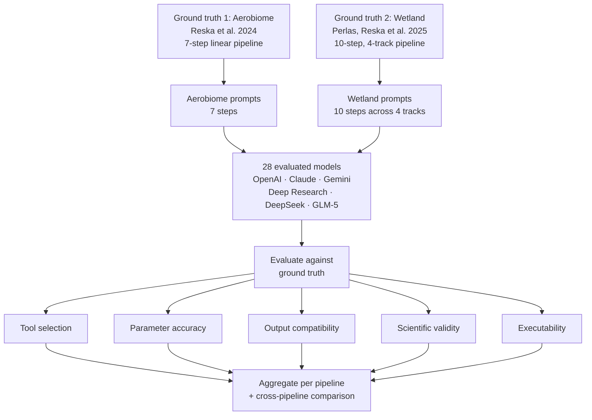

# Against Plausibility: LLM Evaluation

[](../LICENSE)

## Purpose

Against Plausibility: LLM Evaluation documents a structured study of whether large language models can generate scientifically valid nanopore metagenomics pipelines through sequential workflow construction.

The benchmark is anchored to **two independent, published ground-truth workflows** — one for low-biomass air metagenomics and one for multi-omics wetland surveillance — and scores each response across five dimensions: tool selection, parameter accuracy, output compatibility, scientific validity, and executability. The dual-pipeline design tests whether model competence generalizes across fundamentally different analytical paradigms.

The public prompt files in this repository are reconstructed documentation artifacts rather than raw chat exports. Score-relevant constraints from the benchmark setup are documented in those files. This clarification does not change the scoring matrix, rubric outcomes, or rankings.

## Dataset Scope

- Evaluated entries: 28
- Total scored step-results: 476 (196 aerobiome + 280 wetland)
- Pipeline steps: 17 total (7 aerobiome + 10 wetland)
- Ground truth 1 (aerobiome): [Reska T, Pozdniakova S, Urban L. *Air monitoring by nanopore sequencing*. ISME Communications (2024)](https://doi.org/10.1093/ismeco/ycae058)
- Ground truth 2 (wetland): Perlas A\*, Reska T\*, et al. *Real-time genomic pathogen, resistance, and host range characterization from passive water sampling of wetland ecosystems*. Applied and Environmental Microbiology (2025/2026)

### Evaluation groups

| Group | Entries | Role in the benchmark |
|:------|--------:|:----------------------|
| OpenAI core versions | 9 | Longitudinal family trajectory |
| OpenAI interface evaluation | 1 | Supplemental interface-level check (`ChatGPT Deep Research`) |
| Claude core versions | 7 | Longitudinal family trajectory |
| Claude interface evaluation | 1 | Supplemental interface-level check (`Claude Deep Research`) |
| Gemini core versions | 7 | Longitudinal family trajectory |
| Supplemental singleton/interface evaluations | 3 | `Google Gemini Deep Research`, `DeepSeek V3`, `GLM-5` |

The longitudinal comparisons in the radar and timeline figures are restricted to the OpenAI, Claude, and Gemini core version series. Supplemental interface or singleton evaluations remain in the full scoring matrix and in the full heatmap.

## Why this benchmark exists

Most code-generation benchmarks evaluate isolated snippets. Bioinformatics pipelines fail differently: each step constrains the next one, and a locally plausible answer can still poison the full workflow.

The dominant failure mode in this dataset is **plausible but wrong**: code that looks competent, often runs, and would survive superficial review, but makes domain-specific choices that are analytically indefensible. Typical examples include:

- choosing short-read tools for nanopore long-read data
- using incorrect ONT chemistry or quality thresholds
- breaking output chaining between pipeline stages
- omitting polishing, coverage mapping, or multi-level annotation steps that are required by the validated workflow

## Practical Relevance

This benchmark is useful beyond nanopore metagenomics because it measures a broader applied-LLM failure class: multi-step technical work that degrades under composition even when each individual answer looks reasonable.

### Where it is useful

- AI labs evaluating agent reliability on non-toy technical tasks
- Scientific software teams testing whether model outputs remain valid across chained workflow steps
- Technical consultancies assessing whether an LLM-generated workflow can survive expert review before client delivery
- Benchmark designers who want a scored example of domain-grounded, state-carrying evaluation rather than isolated code snippets

### What it tests that many coding benchmarks miss

- whether the model respects domain-specific tool choices rather than generic popularity
- whether outputs from one step are actually consumable by the next
- whether local correctness survives across a seven- or ten-step workflow
- whether apparent competence masks analytical failure
- whether model competence generalizes from a single linear pipeline to a multi-track, multi-omics workflow
- whether models can distinguish between shotgun, amplicon, reference-based, and phylogenetic paradigms

## Evaluation Framework Overview

> **[Interactive flowchart →](flowchart.html)**



## Experimental Design

### Ground truths

**Pipeline 1 — Aerobiome (7 steps, linear):** The validated aerobiome pipeline documented in [`../pipelines/aerobiome/`](../pipelines/aerobiome/) and described in [`methodology/pipeline_reference.md`](methodology/pipeline_reference.md). It processes Oxford Nanopore long-read data from ultra-low biomass environmental air samples prepared with RBK114.24 chemistry. Steps: basecalling → QC → host depletion → taxonomy → assembly → binning → functional annotation.

**Pipeline 2 — Wetland surveillance (10 steps, 4 tracks):** The validated wetland multi-omics pipeline documented in [`../pipelines/wetland-surveillance/`](../pipelines/wetland-surveillance/) and described in [`methodology/pipeline_reference_wetland.md`](methodology/pipeline_reference_wetland.md). It processes dual-extracted DNA and RNA from passive water samplers through four parallel analysis tracks: shotgun metagenomics, RNA virome, eDNA metabarcoding, and AIV whole-genome sequencing. The wetland pipeline tests multi-omics reasoning, multi-paradigm awareness (shotgun vs amplicon vs reference-based vs phylogenetic), and a substantially larger tool space (~30 tools vs ~10).

### Stateless cumulative protocol

This benchmark uses a stateless fresh-chat protocol rather than a single long conversation. For each model:

1. Individual steps were first tested in isolated fresh sessions.
2. Integration prompts were then reconstructed cumulatively from the prior successful state.
3. The evaluator manually carried forward the expected output type and biological context into the next fresh prompt.
4. Errors were not corrected before subsequent steps, allowing upstream mistakes to compound.

This design tests compositional correctness rather than isolated command recall.

### Public prompt documentation

The prompt files in [`prompts/`](prompts/) are **reconstructions** derived from the preserved metadata, the validated ground truth, and the scored notes in the matrix. They are not verbatim exports of the original web-interface chats.

Where the evaluation setup made a score-relevant constraint explicit, the reconstructed prompt documentation records it directly. This includes details such as database choice, output-chaining requirements, and low-biomass thresholding.

## Models Evaluated

### Longitudinal family series

| Family | Versions |
|:-------|:---------|
| OpenAI | GPT-4o, o1-preview, o1-mini, o1, o1-pro, o3-mini, o3 (high reasoning), o4-mini, GPT-5 |
| Claude | Sonnet 3.5, Sonnet 4, Sonnet 4.5, Haiku 4.5, Opus 4.5, Opus 4.6, Sonnet 4.6 |
| Gemini | 2.0 Flash, 2.5 Pro Preview, 2.5 Flash, 2.5 Pro, 3 Pro, 3 Flash, 3.1 Pro |

### Supplemental interface and singleton evaluations

| Entry | Category |
|:------|:---------|
| ChatGPT Deep Research | OpenAI interface evaluation |
| Claude Deep Research | Claude interface evaluation |
| Gemini Deep Research | Google interface evaluation |
| DeepSeek V3 | Singleton external evaluation |
| GLM-5 | Singleton external evaluation |

## Key Findings

### Aerobiome pipeline

#### First fully correct pipeline per family

- OpenAI: GPT-5
- Claude: Opus 4.5
- Gemini: 3 Pro
- Google: Gemini Deep Research
- DeepSeek: none
- Zhipu: none

Later fully correct entries in the current matrix also include Sonnet 4.6, Gemini 3.1 Pro, ChatGPT Deep Research, and Claude Deep Research.

#### Step difficulty

Average composite score across all 28 evaluated entries:

- Binning: 0.59
- Assembly: 0.63
- Functional annotation: 0.62
- Basecalling: 0.69
- Host depletion: 0.75
- Taxonomic classification: 0.84
- Quality control: 0.89

The hardest parts of the benchmark remain the ones that require multi-stage compatibility reasoning rather than one-command recall: assembly, binning, and functional annotation.

### Wetland pipeline

Wetland pipeline evaluation is in progress. The ground truth, prompts, scoring criteria, and evaluation infrastructure are complete. Model scores will be populated as evaluations are conducted.

The wetland pipeline is expected to be substantially harder due to:
- Multi-omics (DNA + RNA) vs single-omics
- 4 parallel analysis tracks vs 1 linear pipeline
- Amplicon metabarcoding tools (OBITools4, VSEARCH, MIDORI2) that are niche and underrepresented in training data
- RNA virome analysis requiring different assembly and classification strategies
- AIV phylogenetics requiring MAFFT, IQ-TREE2, and GISAID-specific workflows

### Heatmap

Composite scores per evaluated entry and pipeline step. Green indicates fully correct behavior; red indicates major analytical or executable failure.


### Longitudinal family comparison

These figures track only the OpenAI, Claude, and Gemini core version series.


### Step ranking


### Recurring failure patterns

- Basecalling failures cluster around wrong ONT model names, wrong Q thresholds, or omission of the basecall → trim → filter tool chain.
- QC failures are usually FastQC-first answers or incomplete nanopore-specific reporting.
- Host-depletion failures are dominated by short-read aligners or by ignoring the low-host air-sample context.
- Taxonomy failures usually involve the wrong Kraken2 database, wrong report/output flags, or missing downsampling context.
- Assembly failures concentrate on short-read assemblers and omitted 3x Racon polishing.
- Binning failures are dominated by overly strict completeness thresholds, single-tool binning, or broken coverage/binning order.
- Functional annotation failures most often miss read-level screening, omit `seqkit` FASTQ → FASTA conversion, or restrict AMR analysis to contigs alone.

## Repository Structure

```text
llm-eval/
├── flowchart.html                    Interactive summary (aerobiome)
├── methodology/
│   ├── pipeline_reference.md         Ground truth: aerobiome pipeline (7 steps)
│   ├── pipeline_reference_wetland.md Ground truth: wetland pipeline (10 steps, 4 tracks)
│   ├── scoring_criteria.md           Base scoring rubric (5 dimensions)
│   ├── scoring_criteria_wetland.md   Wetland-specific scoring extensions
│   └── evaluation_framework.md       Protocol and study design
├── prompts/
│   ├── step_01_*.md ... step_07_*.md Aerobiome prompt reconstructions
│   └── wetland/
│       └── step_01_*.md ... step_10_*.md  Wetland prompt reconstructions
├── responses/                        Directory scaffold (transcripts not included)
│   ├── chatgpt/, claude/, gemini/    Aerobiome response scaffold
│   └── wetland/                      Wetland response scaffold
├── evaluations/
│   ├── summary.md                    Aerobiome curated summary
│   ├── summary_generated.md          Aerobiome script-generated summary
│   ├── by_step/                      Aerobiome step summaries
│   ├── by_model/                     Aerobiome per-entry summaries
│   ├── wetland/                      Wetland evaluation outputs
│   │   ├── by_step/                  Wetland step summaries
│   │   └── by_model/                 Wetland per-entry summaries
│   └── cross_pipeline/              Cross-pipeline comparison
├── results/
│   ├── figures/                      Generated visualizations (per-pipeline + cross-pipeline)
│   └── tables/scoring_matrix.csv     Unified source-of-truth (pipeline column)
└── scripts/
    ├── aggregate_scores.py           Per-pipeline markdown summaries
    ├── generate_heatmap.py           Per-pipeline scoring heatmaps
    ├── generate_radar.py             Per-pipeline radar/timeline/difficulty charts
    └── generate_cross_pipeline.py    Cross-pipeline comparison figures
```

## How to Use This Repository

### For scientists evaluating LLMs for bioinformatics

1. Read [`methodology/evaluation_framework.md`](methodology/evaluation_framework.md) for the protocol and scope.
2. Read [`methodology/pipeline_reference.md`](methodology/pipeline_reference.md) for the validated reference workflow.
3. Use [`evaluations/summary.md`](evaluations/summary.md) for the human-readable interpretation.
4. Use [`evaluations/summary_generated.md`](evaluations/summary_generated.md) plus [`evaluations/by_step/`](evaluations/by_step/) and [`evaluations/by_model/`](evaluations/by_model/) for matrix-derived drill-down.

### For AI researchers

1. Use [`results/tables/scoring_matrix.csv`](results/tables/scoring_matrix.csv) as the source of truth.
2. Use the prompt reconstructions in [`prompts/`](prompts/) to understand the public prompt shape.
3. Use the scoring rubric in [`methodology/scoring_criteria.md`](methodology/scoring_criteria.md) to adapt the benchmark to another domain.
4. Treat this repository as a scored benchmark artifact set, not as a raw transcript archive.

### For applied AI teams and consultancies

1. Use [`evaluations/summary.md`](evaluations/summary.md) to see where plausible outputs fail under domain review.
2. Use [`results/tables/scoring_matrix.csv`](results/tables/scoring_matrix.csv) to inspect step-specific weaknesses by model family.
3. Use [`methodology/evaluation_framework.md`](methodology/evaluation_framework.md) as a template for evaluating your own multi-step technical workflows.
4. Use the aerobiome reference pipeline to compare benchmark behavior against a fully specified real workflow rather than a toy task.

### Reproducing derived outputs

```bash
pip install -r requirements.txt
python scripts/aggregate_scores.py       # Per-pipeline markdown summaries
python scripts/generate_heatmap.py       # Per-pipeline scoring heatmaps
python scripts/generate_radar.py         # Per-pipeline radar/timeline/difficulty charts
python scripts/generate_cross_pipeline.py  # Cross-pipeline comparison (requires both pipelines scored)
```

## Limitations

- Interface dependence: the benchmark reflects web-interface behavior, not API-only behavior.
- Two ground truths from the same research group: both reference pipelines involve the same first/co-first author, which means both share similar tool preferences and analytical style.
- Sequential dependency by design: upstream errors contaminate downstream prompts when the state is carried forward.
- Missing raw transcript archive: this public repository does not contain the full raw chat logs used during evaluation.
- Rater subjectivity: scoring was performed by a single domain expert.
- Model drift: the matrix is a dated snapshot of tested behavior, not a claim about current or future service behavior.

## Data Availability

This public repository contains the validated reference pipeline, the scoring matrix, reconstructed prompt documents, generated per-step and per-model summaries, and the visualization scripts. It does not contain the full raw web-interface conversation logs.
