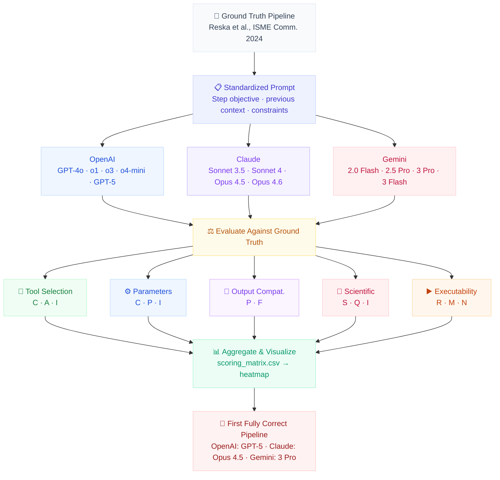
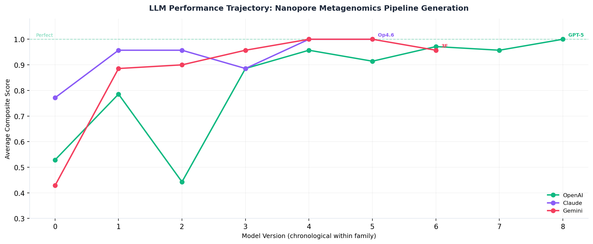
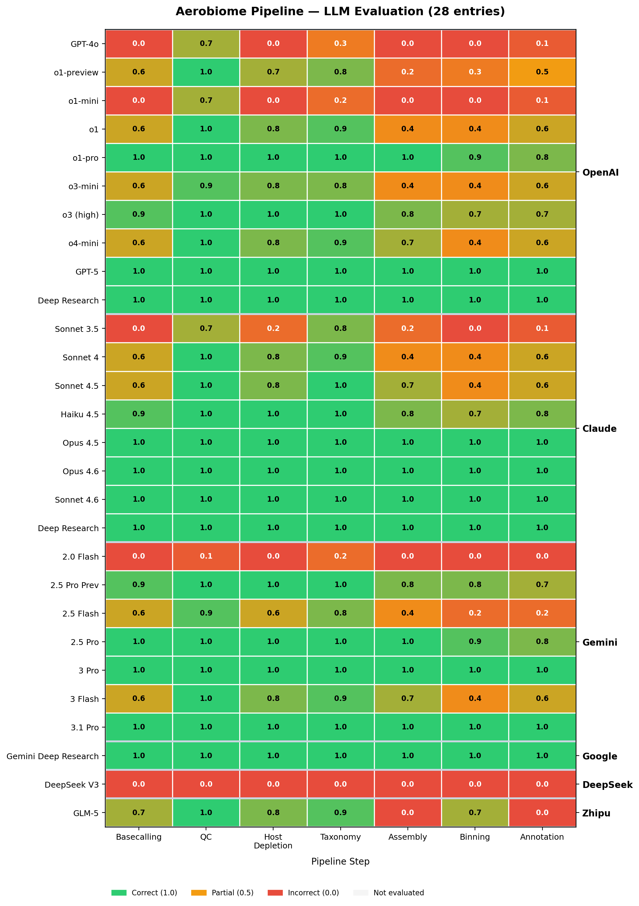
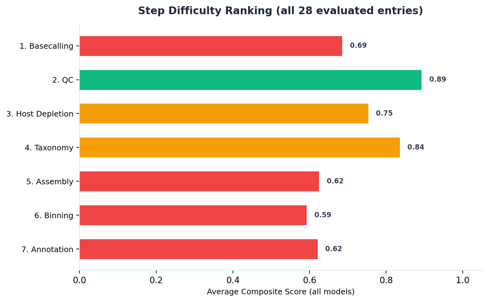
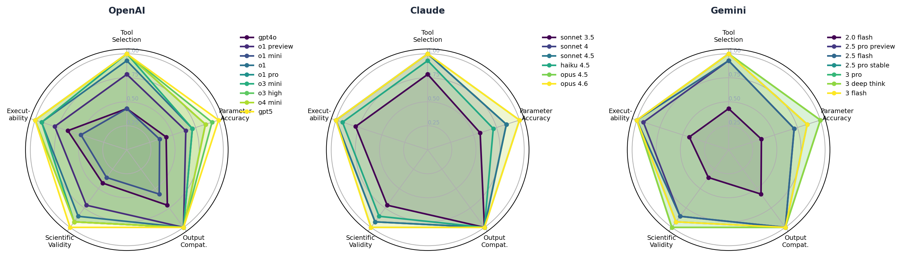

# Systematic Evaluation of Large Language Models for Nanopore Metagenomics Pipeline Development

[](LICENSE)

## Purpose

This repository documents a structured evaluation of large language models (LLMs) for their ability to generate correct, production-ready nanopore metagenomics pipelines through sequential prompting.

Most existing LLM benchmarks for code generation test isolated tasks: "write a function that does X." But real bioinformatics pipeline development is sequential — each step produces output that becomes input for the next, tool choices constrain downstream options, and errors compound. A model that selects the wrong tool at step 3 will produce a pipeline that fails at step 4, even if every subsequent code block is syntactically correct.

This evaluation tests whether LLMs can maintain scientific and technical correctness across a full pipeline, not just within individual steps.

### Why this matters

The dominant failure mode observed is **"plausible but wrong"**: generated code that runs, looks reasonable, and would pass a surface-level review — but makes domain-specific choices that an expert would immediately reject. Examples include recommending short-read tools for long-read data, using deprecated software, or setting parameters that are syntactically valid but scientifically inappropriate.

These failures are invisible to automated code-correctness benchmarks and dangerous precisely because they are plausible. In regulated environments (pharma, clinical diagnostics, environmental monitoring), a plausible-but-wrong pipeline can compromise data integrity, produce misleading results, or violate analytical validation requirements — without triggering any automated error.

**This evaluation framework provides a reusable methodology for testing AI reliability in any domain where correctness has consequences beyond code execution.**

## Evaluation Framework Overview

> **[Interactive flowchart →](flowchart.html)**



*Repeat for each of 7 pipeline steps (basecalling → QC → host depletion → taxonomy → assembly → binning → annotation)*

## Experimental Design

### Ground truth

The reference pipeline is the validated workflow from:

> Reska T, Pozdniakova S, Urban L. "Air monitoring by nanopore sequencing." *ISME Communications* (2024). DOI: [10.1093/ismeco/ycae058](https://doi.org/10.1093/ismeco/ycae058)

This pipeline processes Oxford Nanopore long-read sequencing data from low-biomass environmental samples generated with the Rapid Barcoding Kit (RBK114.24). It was developed, validated, and published independently of any LLM assistance.

### Sequential prompting protocol

Each model was evaluated using the same sequence of prompts, where each prompt:

1. Specifies the pipeline step to implement
2. Provides the output context from the previous step
3. Requests runnable code with tool selection rationale

The prompts were designed to simulate how a scientist actually develops a workflow in conversation with an LLM — incrementally, building each step on the last. See [`methodology/evaluation_framework.md`](methodology/evaluation_framework.md) for the full protocol.

### Models tested

| Family | Version | Released | Tested |
|:-------|:--------|:---------|:-------|
| OpenAI | GPT-4o | 2024-05-13 | 2024-05-16 |
| OpenAI | o1-preview | 2024-09-12 | 2024-09-17 |
| OpenAI | o1-mini | 2024-09-12 | 2024-09-14 |
| OpenAI | o1 | 2024-12-05 | 2024-12-11 |
| OpenAI | o1-pro | 2024-12-05 | 2024-12-09 |
| OpenAI | o3-mini | 2025-01-31 | 2025-02-03 |
| OpenAI | o3 (high reasoning) | 2025-04-16 | 2025-04-18 |
| OpenAI | o4-mini | 2025-04-16 | 2025-04-21 |
| OpenAI | GPT-5 | 2025-08-07 | 2025-08-11 |
| Claude | Sonnet 3.5 | 2024-06-21 | 2024-06-24 |
| Claude | Sonnet 4 | 2025-05-23 | 2025-05-28 |
| Claude | Sonnet 4.5 | 2025-09-30 | 2025-10-02 |
| Claude | Haiku 4.5 | 2025-10-16 | 2025-10-22 |
| Claude | Opus 4.5 | 2025-11-24 | 2025-11-27 |
| Claude | Opus 4.6 | 2026-02-05 | 2026-02-09 |
| Gemini | 2.0 Flash | 2024-12-11 | 2024-12-14 |
| Gemini | 2.5 Pro Preview | 2025-03-03 | 2025-03-07 |
| Gemini | 2.5 Flash | 2025-06-17 | 2025-06-19 |
| Gemini | 2.5 Pro (stable) | 2025-06-26 | 2025-07-01 |
| Gemini | 3 Pro | 2025-11-17 | 2025-11-20 |
| Gemini | 3 Deep Think | 2025-11-17 | 2025-11-23 |
| Gemini | 3 Flash | 2025-12-16 | 2025-12-20 |

### Pipeline steps

| Step | Objective | Ground Truth Tools |
|:-----|:----------|:---|
| 1 | Basecalling, adapter trimming, and length filtering | Guppy v6.3.2 / Dorado v4.3.0 → Porechop v0.2.3 → NanoFilt v2.8.0 |
| 2 | Quality control and read statistics | NanoPlot / NanoStat |
| 3 | Host/human DNA depletion | Not performed (low host contamination in air samples) |
| 4 | Taxonomic classification of reads | Kraken2 v2.0.7 + NCBI nt database |
| 5 | Metagenomic assembly | MetaFlye v2.9.1 → minimap2 v2.17 + Racon v1.5 (3×) |
| 6 | Binning and MAG quality assessment | metaWRAP v1.3 + CheckM v1.2.2 |
| 7 | Functional annotation | AMRFinderPlus v3.12.8 + ABRicate v1.0.1 |

## Scoring Framework

Each model × step combination is evaluated across five dimensions:

| Dimension | Levels | What it tests |
|:----------|:-------|:--------------|
| **Tool Selection** | Correct / Acceptable / Incorrect | Did the model choose an appropriate tool for nanopore long-read data? |
| **Parameter Accuracy** | Correct / Partially Correct / Incorrect | Were flags, thresholds, and kit-specific settings appropriate? |
| **Output Compatibility** | Pass / Fail | Does the output chain correctly into the next step? |
| **Scientific Validity** | Sound / Questionable / Incorrect | Are the analytical choices defensible for this data type? |
| **Executability** | Runs / Runs with Minor Fixes / Does Not Run | Does the generated code actually execute? |

Detailed rubrics with concrete examples are in [`methodology/scoring_criteria.md`](methodology/scoring_criteria.md).

## Key Findings

**Headline result:** No LLM produced a fully correct end-to-end pipeline until the latest model generation:

- **OpenAI:** first fully correct at GPT-5 (high)
- **Claude:** first fully correct at Opus 4.5
- **Gemini:** first fully correct at 3 Pro

### Performance trajectory

All three families show clear upward trajectories, but convergence to full correctness required multiple model generations:



### Scoring heatmap

Composite scores (0–1) per model × pipeline step. Green = fully correct, red = major errors:



### Step difficulty ranking

Binning, assembly, and functional annotation consistently cause the most errors across all models:



### Error patterns by scoring dimension

The radar charts reveal how each model family improves across the five evaluation dimensions over successive versions:



### Key observations

1. **Compounding failures:** Errors at early steps (especially step 1: basecalling) cascade through the entire pipeline. A model recommending Albacore (discontinued) or SPAdes (short-read assembler) produces unusable output that invalidates all downstream steps.

2. **Hardest steps** (average composite score across all models):
   - **Binning** (0.54) — models default to single binning tools instead of ensemble approaches, use inappropriate completeness thresholds (≥50–90% instead of ≥30%), and often produce wrong pipeline order for mapping/binning
   - **Assembly** (0.61) — the required 3× Racon polishing step is frequently omitted or reduced; multiple models recommend short-read assemblers (SPAdes, MEGAHIT) instead of MetaFlye
   - **Functional annotation** (0.61) — most models apply AMR screening at only one level (contigs), missing the three-level approach (reads, contigs, bins); seqkit conversion step routinely omitted
   - **Basecalling** (0.66) — wrong tool selection (Albacore, wrong Guppy config) or incorrect quality thresholds (Q20–Q30 instead of Q8); many models ignore the R10.4.1 chemistry specification

3. **Most common failure modes:**
   - **Wrong tools** — recommending short-read tools (SPAdes, BWA, Bowtie2, FastQC) for nanopore long-read data
   - **Wrong flags** — incorrect parameters, quality thresholds, database specifications, and preset selections
   - **Wrong pipeline order** — placing steps in illogical sequences (e.g., annotation before assembly) or inverting sub-steps within a stage
   - **Ignoring input details** — failing to account for low-biomass sample type, R10.4.1 chemistry, air sample context, or previously provided pipeline outputs

## Repository Structure

```
llm-eval/
├── flowchart.html                    Interactive evaluation framework diagram
├── methodology/                      Evaluation protocol, scoring rubrics, ground truth pipeline
├── prompts/                          Standardized prompts used for each pipeline step
├── responses/                        Raw, unedited LLM responses organized by model family/version
├── evaluations/                      Scored evaluations organized by step and by model
├── results/
│   ├── figures/                      Heatmaps and other visualizations
│   └── tables/scoring_matrix.csv     Structured scoring data
└── scripts/                          Python scripts for generating figures and summaries
```

## How to Use This Repository

### For scientists evaluating LLMs for bioinformatics

1. Read [`methodology/evaluation_framework.md`](methodology/evaluation_framework.md) for the evaluation protocol
2. Review [`methodology/pipeline_reference.md`](methodology/pipeline_reference.md) for the ground truth pipeline
3. Browse `evaluations/by_step/` to see how models performed on specific pipeline stages
4. Check `evaluations/by_model/` to track improvement across model versions

### For AI researchers studying domain-specific code generation

1. The scoring framework in [`methodology/scoring_criteria.md`](methodology/scoring_criteria.md) provides a reusable rubric
2. Raw prompts in `prompts/` and responses in `responses/` are available for analysis
3. The sequential evaluation design tests compositional correctness, not just isolated task performance
4. `results/tables/scoring_matrix.csv` provides the structured data for quantitative analysis

### Reproducing figures

```bash
pip install -r requirements.txt
python scripts/generate_heatmap.py   # Scoring heatmap
python scripts/generate_radar.py     # Radar charts, step difficulty, timeline
python scripts/aggregate_scores.py   # Aggregate statistics
```

### Adapting this framework to other domains

The evaluation methodology is designed to be **domain-agnostic**. To adapt it to a different field:

1. Replace `methodology/pipeline_reference.md` with your validated ground truth workflow
2. Update the scoring rubrics in `methodology/scoring_criteria.md` for your domain's correctness criteria
3. Modify the prompt templates in `prompts/` to match your task decomposition
4. Re-use the scoring dimensions (tool selection, parameter accuracy, output compatibility, scientific validity, executability) — they generalize across any multi-step technical workflow

## Limitations & Threats to Validity

- **Interface dependence:** Models were tested via web interfaces, not APIs. Temperature, system prompt, and other parameters may differ between access methods and affect reproducibility.
- **Knowledge cutoff bias:** Newer models may benefit from training on more recent bioinformatics literature, including potentially the ground truth publication itself. This is noted but not controlled for.
- **Sequential dependency by design:** Earlier errors influence later responses. This reflects real-world usage patterns but complicates per-step capability isolation.
- **Single ground truth:** The reference pipeline represents one validated approach for one data type. Alternative valid approaches exist, and the scoring framework accounts for this via the "Acceptable" category. Extending to additional ground truths would strengthen generalizability.
- **Sample size:** One evaluation per model version per step. LLM outputs are stochastic; repeated runs may yield different results. A production evaluation would require multiple independent runs per configuration.
- **Rater subjectivity:** Scoring was performed by a single domain expert. Inter-rater reliability studies would strengthen the framework for high-stakes applications.
- **Evolving model landscape:** Models are continually updated. Results represent a snapshot at the tested date and may not reflect current model capabilities.

> **Note for regulated environments:** This evaluation framework demonstrates the *type* of validation required before deploying AI-generated analytical workflows in GxP, CLIA, or ISO 17025-regulated settings. It is not itself a qualified validation protocol.

## Citation

If you use this evaluation framework or reference these results, please cite:

```bibtex
@misc{reska2025llmeval,
  author = {Reska, Tim},
  title = {Systematic Evaluation of Large Language Models for Nanopore Metagenomics Pipeline Development},
  year = {2025},
  url = {https://github.com/ttmgr/TR/tree/main/llm-eval}
}
```

Reference pipeline:

```bibtex
@article{reska2024airmonitoring,
  author = {Reska, Tim and Pozdniakova, Svitlana and Urban, Lara},
  title = {Air monitoring by nanopore sequencing},
  journal = {ISME Communications},
  year = {2024},
  doi = {10.1093/ismeco/ycae058}
}
```

## License

[MIT License](LICENSE) — Tim Reska, 2025
