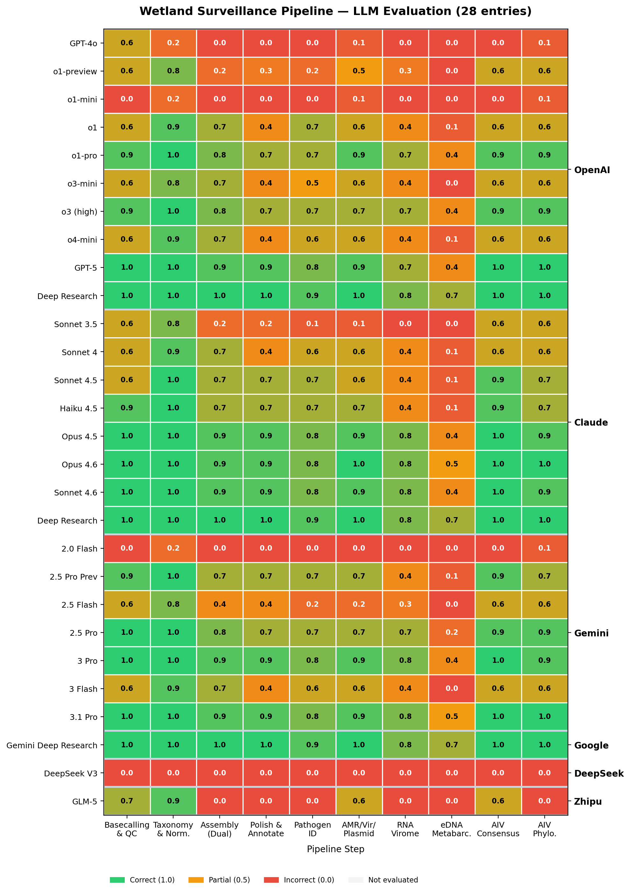

# Evaluation Summary — Wetland Pipeline

## Overview

The wetland evaluation covers 28 evaluated entries across 10 pipeline steps, yielding 280 scored step-results. The 10-step, 4-track multi-omics workflow (DNA shotgun + RNA virome + 12S eDNA metabarcoding + AIV whole-genome sequencing) is deliberately harder than the aerobiome benchmark: it combines shotgun, amplicon, reference-based, and phylogenetic paradigms within a single pipeline. The scores bear this out — no model from any family reaches full end-to-end correctness in the current matrix.

The public wetland prompt files in [`../../prompts/wetland/`](../../prompts/wetland/) are reconstructed documentation artifacts, not raw transcript exports. Score-relevant benchmark constraints (track-specific QC thresholds, database choices, niche tool names, multi-paradigm transitions) are documented in the reconstructed prompts.

## Key Findings

### First fully correct pipeline per family

| Model family | First fully correct version | Notes |
|:-------------|:----------------------------|:------|
| OpenAI | None | GPT-5 and ChatGPT Deep Research are the closest; both fail at Steps 5, 7, and 8 where zero entries reach full correctness |
| Claude | None | Opus 4.5 / 4.6, Sonnet 4.6, and Claude Deep Research come closest but miss MEGAN-CE (Step 5) and OBITools4 + MIDORI2 (Step 8) |
| Gemini | None | Gemini 3 Pro / 3.1 Pro come closest in the core series; same failure pattern at Steps 5, 7, 8 |
| Google (interface) | None | Gemini Deep Research recovers the dual assembler and MEGAN-CE concepts but still misses one or more rubric thresholds on Steps 5, 7, 8 |
| DeepSeek | None | DeepSeek V3 fails across the board with broken code generation |
| Zhipu | None | GLM-5 fails across the board |

The three **Deep Research** interface entries (ChatGPT, Claude, Google Gemini) are structurally different from the core-version entries — they can surface niche tools (MEGAN-CE, nanoMDBG, OBITools4, MIDORI2) through inference-time web search. They are the only entries that routinely recover the paradigm-specific toolchain, which is the load-bearing constraint on the wetland benchmark.

### Hardest steps across all evaluated entries

| Rank | Step | Average composite score | Fully correct (of 28) |
|:-----|:-----|------------------------:|----------------------:|
| 1 | 8. eDNA metabarcoding | 0.23 | 0 |
| 2 | 7. RNA virome | 0.46 | 0 |
| 3 | 5. Pathogen identification | 0.54 | 0 |
| 4 | 4. Polishing and annotation | 0.55 | 3 |
| 5 | 3. Metagenomic assembly | 0.61 | 3 |
| 6 | 6. AMR / virulence / plasmid | 0.62 | 4 |
| 7 | 10. AIV phylogenetics | 0.66 | 6 |
| 8 | 9. AIV consensus | 0.71 | 9 |
| 9 | 1. Basecalling and QC | 0.72 | 10 |
| 10 | 2. Taxonomic classification | 0.83 | 15 |

The three pivot steps — eDNA metabarcoding (Step 8), RNA virome (Step 7), and pathogen identification (Step 5) — have **zero fully correct entries**. All three are **paradigm transitions** away from shotgun DNA metagenomics: amplicon clustering against MIDORI2, reference-based viral protein classification, and conservative LCA-based pathogen assignment with MEGAN-CE. This is the main finding of the wetland evaluation: the bottleneck is not compositional reasoning within a paradigm but the recognition that a different paradigm is required at all.

### Per-track observations

**Track 1 — Shotgun metagenomics (Steps 1–6).** Taxonomic classification (Step 2) is the easiest step across the whole benchmark (0.83 mean, 15 fully correct) because Kraken2 is familiar. The dual assembler strategy (metaFlye + nanoMDBG) is the first hard transition: 25 of 28 entries recommend metaFlye alone and never surface nanoMDBG. Pathogen identification (Step 5) falls off sharply because MEGAN-CE LCA is absent from core-version training data; models default to Kraken2 alone or generic BLAST, neither of which provides the conservative genus-level LCA required. AMR / virulence / plasmid (Step 6) fails in layered ways: models that get AMRFinderPlus right often skip `--plus` mode, Prodigal ORF prediction, VFDB virulence screening, or PlasmidFinder.

**Track 2 — RNA virome (Step 7).** Zero fully correct entries. The dominant failure is category-level: models apply DNA shotgun tooling (metaFlye, Kraken2, ABRicate) to RNA virome input. A second-tier failure is using DIAMOND BLASTx against the wrong database (NCBI nt instead of NCBI NR protein) or omitting the viral taxid filter (10239) at the ≥ 80% identity threshold. Only the Deep Research variants recover the full nanoMDBG + Medaka + DIAMOND BLASTx (NR) + viral-taxid chain.

**Track 3 — eDNA vertebrate metabarcoding (Step 8).** The hardest step in the benchmark (0.23 mean). The failure is paradigm-level: 16 of 28 entries treat 12S amplicons as shotgun metagenomics and recommend Kraken2, MetaPhlAn, or BLAST-vs-nt. Of the 12 entries that recognize the amplicon paradigm, most pair VSEARCH with an incorrect upstream demultiplex step (Dorado barcoding instead of OBITools4 obimultiplex on the 9 bp tag structure) and an incorrect taxonomy database (NCBI nt instead of MIDORI2 12S). OBITools4 is essentially unknown to the core-version models.

**Track 4 — AIV whole-genome sequencing and phylogenetics (Steps 9–10).** Better than Tracks 2 and 3 because reference-based viral consensus is a familiar paradigm. AIV consensus (Step 9) has 9 fully correct entries; the typical failure is a single-pass mapping that skips `samtools idxstats` for segment-specific reference selection before re-mapping. AIV phylogenetics (Step 10) has 6 fully correct entries; the typical failure is MAFFT + a generic ML tree that misses IQ-TREE2 with ModelFinder Plus (`-m MFP`) and dual branch-support (1000 UFboot + 1000 SH-aLRT).

### Cross-step error compounding

Because the wetland pipeline is a state-carrying multi-track workflow, upstream paradigm errors poison multiple downstream steps simultaneously. A model that treats Step 1 with a single QC threshold carries wrong-length or wrong-quality reads into *all four* downstream tracks, not just the shotgun track. A model that recommends short-read or single-assembler output at Step 3 cannot produce the contig set needed for Step 4 polishing, Step 5 MEGAN LCA on contigs, or Step 6 AMRFinderPlus on protein-level contigs. A model that fails to recognize the amplicon paradigm at Step 8 produces an OTU table that cannot be cross-referenced against MIDORI2 for avian species assignment. The compounding effect is therefore larger than in the single-track aerobiome pipeline.

## Scoring Heatmap (Wetland Pipeline)

The wetland heatmap shows a three-band structure: the left-hand steps (Steps 1–2) are broadly green across mid-generation and later entries, the middle steps (3–6) show a mixed pattern that separates core-version models from Deep Research entries, and the niche paradigm steps (5, 7, 8) stay predominantly red or amber across *every* family. AIV consensus and phylogenetics (9, 10) rebound partially because reference-based viral work is a well-known paradigm. Only the three Deep Research interface entries approach uniformly green profiles, and even they fall short of the aerobiome fully-correct bar.

## Conclusions

The wetland benchmark sharpens the main claim of the project: model competence on a single linear bioinformatics pipeline does **not** generalize to a multi-track, multi-paradigm pipeline. Every core-version model that fully clears the aerobiome pipeline fails on the wetland pipeline, and the failure is consistently at the same three paradigm-transition steps rather than diffuse across the benchmark.

For scientific users, this means that LLM-drafted workflows remain a poor substitute for expert review precisely when the workflow crosses analytical paradigms — which is where One Health, environmental surveillance, and multi-omics studies live. For AI researchers, this is a scored example of a benchmark that cannot be saturated by scaling a single paradigm: improvement requires either broader retrieval (the Deep Research path) or training-data coverage of niche domain tools.

## Recommendations

- Treat paradigm transitions (shotgun → amplicon → reference-based → phylogenetic) as **review gates** when an LLM drafts a multi-track pipeline. These are where the current generation of core-version models silently fails.
- When using an LLM to draft a wetland-style pipeline, surface the four tracks explicitly in the prompt and ask the model to name the tool chain per track *before* writing code. This converts a chaining failure into a detectable tool-selection failure.
- Prefer retrieval-augmented or search-capable interfaces (Deep Research variants) when the workflow involves niche tooling such as MEGAN-CE, OBITools4, nanoMDBG, or MIDORI2.
- Validate database choice explicitly at every step: nt_core vs Standard, NCBI NR vs nt, MIDORI2 vs NCBI nt, and the NCBI Influenza Virus Database — these are the single most common failure points in the wetland matrix.
- Re-run the wetland evaluation whenever a new core-version model is released; the benchmark is a dated snapshot and paradigm-coverage improves over time.

## Further reading

- Per-step wetland drilldowns: [`by_step/`](by_step/)
- Per-model wetland drilldowns: [`by_model/`](by_model/)
- Auto-generated matrix summary: [`summary_generated.md`](summary_generated.md)
- Wetland ground-truth pipeline reference: [`../../methodology/pipeline_reference_wetland.md`](../../methodology/pipeline_reference_wetland.md)
- Aerobiome counterpart: [`../summary.md`](../summary.md)
- Cross-pipeline comparison: [`../cross_pipeline/summary.md`](../cross_pipeline/summary.md)
