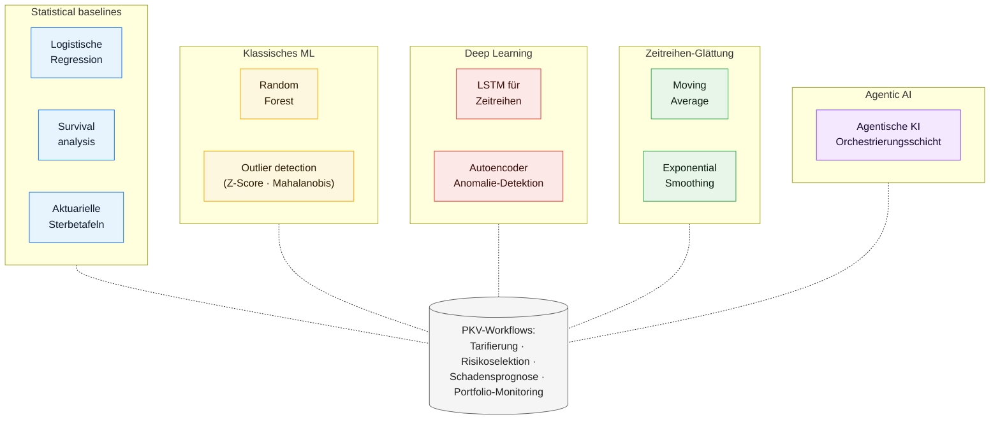

# PKV ML Framework Explorer

A self-contained, browser-based catalogue of machine-learning and actuarial methods relevant to German private health insurance (PKV) workflows. Each method is documented with the problem it solves, a worked example, the underlying assumptions, and the trade-offs you accept when choosing it.

## What this is

An onboarding and reference instrument — for actuaries new to ML, ML practitioners new to insurance, and reviewers who want a quick refresher on a specific method's strengths and limits. The interface language is German (the target audience is the DACH PKV market). Designed as a companion to the applied-ML work in [`../disease-progression/`](../disease-progression/) and [`../medrisk/`](../medrisk/).

## Run it

```bash
open index.html          # macOS
xdg-open index.html      # Linux
```

No build step, no dependencies. Single HTML entry point.

## Methods covered



| Method | Typical PKV use case |
|:-------|:---------------------|
| Logistische Regression | Storno-Wahrscheinlichkeit, Risikoeinstufung |
| Random Forest | Multivariates Risiko-Scoring, Variable importance |
| LSTM | Zeitabhängige Schadensvorhersage, Krankheitsverläufe |
| Autoencoder | Anomalie-Detektion in Schadensströmen |
| Z-Score / Mahalanobis | Univariate / multivariate Ausreißer-Erkennung |
| Aktuarielle Sterbetafeln | Reservierung, Prämienberechnung |
| Moving Average / Exponential Smoothing | Kurzfristige Trendprognose |
| Survival analysis | Time-to-event-Modellierung (Erstdiagnose, Reha-Eintritt) |
| Agentische KI | Orchestrierung mehrstufiger Underwriting-Workflows |

## Stack

Vanilla HTML + CSS + JavaScript, single file. No bundler, no runtime dependencies.

## Companion projects

- [`../disease-progression/`](../disease-progression/) — production-grade implementation of survival analysis and multistate Markov on synthetic clinical cohorts.
- [`../medrisk/`](../medrisk/) — full underwriting platform that operationalizes several of these methods with confidence-calibrated failure detection.
